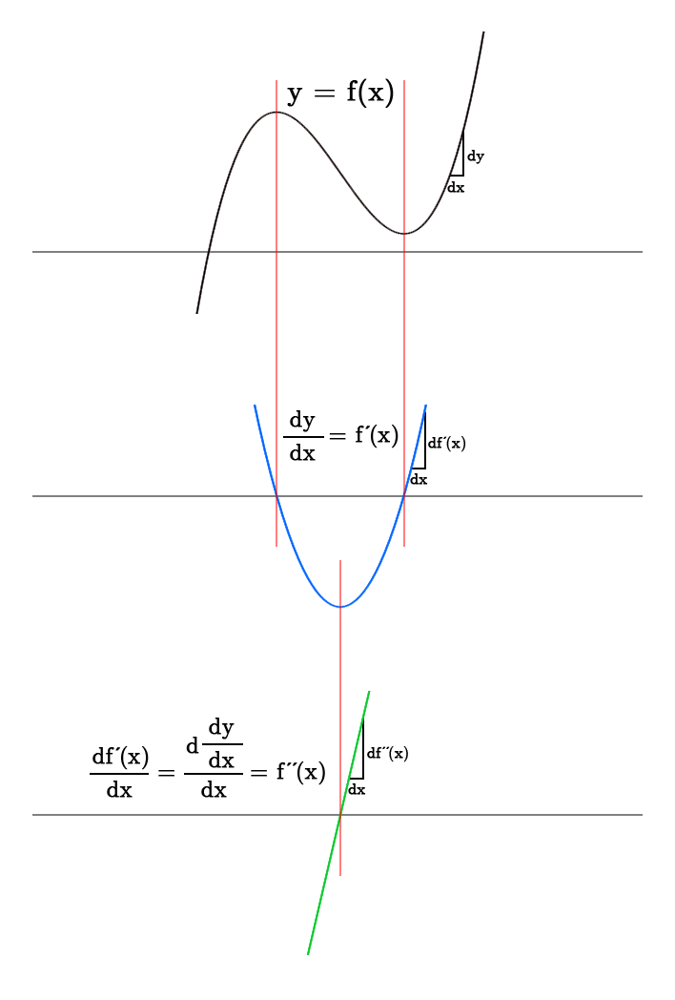

# Calculus

## 미적분의 필요성

### 적분: 넓이, 부피

#### 다각형의 넓이 = 삼각형의 넓이의 합

#### 원의 넓이 = 다각형의 넓이로 근사 (approximation)

그리스인들은 극한의 개념을 몰랐고, 실진법 (method of exhaustion) 을 사용했다.

#### 그래프의 밑넓이 = 사각형의 넓이의 합으로 근사

### 미분: 접선 - 순간 변화 - 속도와 가속도

이동 거리 -> 속도  -> 가속도

순간 속도는 평균 속도의 극한! 이를 구하는 것이 바로 미분이다.

순간 가속도는 평균 속도의 극한

## 함수

### 함수의 정의

**함수 $f$** 는 집합 $D$ 의 각 원소 $x$ 에 대해 집합 $E$ 에 속하는 단 하나의 원소 $f(x)$ 를 대응시키는 **규칙이다**.

#### 정의역 (domain)

집합 $D$ 는 함수의 정의역 (Domain)

#### 공역 (codomain), 치역 (range)

집합 $E$ 는 함수의 공역(Codomain)

집합 $E$ 중에 $f(x)$ 에 해당하는 원소들의 집합은 **치역(Range)**

#### 독립변수 (independent variable), 종속변수 (dependent variable)

독립변수: 정의역에 속하는 임의의 수
종속변수: 치역에 속하는 수

### 함수의 표현

#### 그래프 = 순서쌍의 집합

##### 수직선 판정법 (vertical line test)

#### 대수 -> 명확한 식

### 조각마다 정의된 함수 (piecewise defined function)

### 대칭 - 우함수 (even), 기함수 (odd)

우함수 **even** function = y축에 대해 대칭

기함수 **odd** function = 원점에 대해 대칭

x축에 대해 대칭이면? 함수가 아니다! => 음함수

### 증가함수 (increasing), 감소함수 (decreasing)

#### 증가함수
구간 $I$ 에 있는 $x_1 < x_2$ 인 임의의 $x_1$, $x_2$ 에 대해
$$
f(x_1) < f(x_2)
$$
을 만족하면 함수 $f$ 는 구간 $I$ 에서 증가함수(increasing function)이다.

#### 감소함수

구간 $I$ 에 있는 $x_1 < x_2$ 인 임의의 $x_1$, $x_2$ 에 대해
$$
f(x_1) > f(x_2)
$$
을 만족하면 함수 $f$ 는 구간 $I$ 에서 감소함수(decreasing function)이다.

### 주요 함수의 종류

#### 선형 함수

#### 다항 함수

##### 이차 함수 (quadratic function)

##### 삼차 함수 (cubic function)

#### 거듭제곱함수 (power function)

##### 거듭제곱근함수 (root function)

##### 반비례함수 (reciprocal function)

#### 유리함수 (rational function)

#### 대수함수 (algebraic function)

#### 삼각함수 (trigonometric function)

#### 지수함수 (exponential function)

#### 로그함수 (logarithmic function)

### 함수의 변환 ()

#### 이동 (translation)

#### 확대 (stretching)

#### 대칭 (reflecting)

### 함수의 결합 - 합성함수 (composite function)

주어진 두 함수 $f$ 와 $g$ 에 대해
$$
(f \circ g)(x) = f(g(x))
$$
와 같이 정의되는 함수 $f \circ g$ 를 **합성함수** 혹은 **$f$ 와 $g$ 의 합성** 이라고 한다.

#### 함수의 분해 ()

## 극한

### 극한의 정의

#### 대략적 정의

#### 엄밀한 정의

### 한쪽 극한

### 무한 극한, 수직 점근선

### 극한 법칙

### 연속

#### 오른쪽으로부터 연속, 왼쪽으로부터 연속, 구간에서 연속

## 미분법 differentiation

### 직선의 기울기 = 차분몫 (difference quotient)

$$
\begin{aligned}
m &= \dfrac{\Delta y}{\Delta x} \\
&= \dfrac{f(x + h) - f(x)}{h}
\end{aligned}
$$

### 곡선의 기울기

#### 할선 (secant line) 의 기울기

점 $P(a, f(a))$ 와 점 $Q(x, f(x))$ 를 지나는 할선 $PQ$ 의 기울기는
$$
m_{PQ} = \dfrac{f(x) - f(a)}{x - a}
$$
와 같다.

#### 접선 (tangent line) 의 기울기

접선의 기울기는 할선의 기울기의 **극한**!

$$
m = \lim_{x \rightarrow a}{\dfrac{f(x) - f(a)}{x - a}}
$$

### 도함수 (derivative) <- 미분계수

#### 정의
$$
\begin{aligned}
f'(x) & = \lim_{\Delta x \rightarrow 0} \dfrac{\Delta f}{\Delta x}
\\
& = \lim_{\Delta x \rightarrow 0} \dfrac{f(x+\Delta x) - f(x)}{\Delta x}
\end{aligned}
$$

#### 미분연산자 (differentiation operator)

#### 구간 (interval)

##### 개구간 (open interval)

##### 폐구간 (closed interval)

#### 미분가능 (differrentiable)

#### 표기법 (notations)

##### 1계 도함수

$$
f'(x)  = \dfrac{df}{dx} = \dfrac{d}{dx}f = \dfrac{d}{dx}f(x) = y' = \dfrac{dy}{dx}
$$

##### 2계 도함수 (second derivative)

$$
y'' = f''(x) = \dfrac{d^2y}{dx^2}
$$

##### 3계 도함수 (third derivative)

$$
y''' = f'''(x) = \dfrac{d^3y}{dx^3}
$$

##### n계 도함수

$$
y^{(n)} = f^{(n)}(x) = \dfrac{d^ny}{dx^n}
$$

#### 예시1

$$
f(x)=x^2
$$

$$
\begin{aligned}
& \dfrac{\Delta f}{\Delta x}
\\
& = \dfrac{(x+\Delta x)^2 - x^2}{\Delta x}
\\
& = \dfrac{x^2+2x\Delta x + \Delta x^2 - x^2}{\Delta x}
\\
& = \dfrac{2x\Delta x + \Delta x^2}{\Delta x}
\\
& = 2x + \Delta x
\\
\\
\dfrac{d}{dx}f(x) & = \lim_{\Delta x \rightarrow 0} \dfrac{\Delta f}{\Delta x} 
\\
& = \lim_{\Delta x \rightarrow 0}(2x + \Delta x)
\\
& = 2x
\\
\\
\therefore f'(x) & = 2x
\end{aligned}
$$

#### 예시2

$$
f(x)=\dfrac{1}{x}
$$

$$
\begin{aligned}
& \dfrac{\Delta f}{\Delta x}
\\
& = \dfrac{\dfrac{1}{x+\Delta x} - \dfrac{1}{x}}{\Delta x}
\\
& = \dfrac{1}{\Delta x} \left( \dfrac{1}{x+\Delta x} - \dfrac{1}{x} \right)
\\
& = \dfrac{1}{\Delta x} \left( \dfrac{x}{x(x+\Delta x)} - \dfrac{x+\Delta x}{x(x+\Delta x)} \right)
\\
& = \dfrac{1}{\Delta x} \cdot  \dfrac{x-(x+\Delta x)}{x(x+\Delta x)}
\\
& = \dfrac{1}{\Delta x} \cdot  \dfrac{-\Delta x}{x(x+\Delta x)}
\\
& = \dfrac{-1}{x(x+\Delta x)}
\\
\\
\dfrac{d}{dx}f(x) & = \lim_{\Delta x \rightarrow 0} \dfrac{\Delta f}{\Delta x} 
\\
& = \lim_{\Delta x \rightarrow 0} \dfrac{-1}{x(x+\Delta x)}
\\
& = \dfrac{-1}{x^2}
\\
\\
\therefore f'(x) & = -\dfrac{1}{x^2}
\end{aligned}
$$

### 상수함수의 미분

$$
f(x) = c
$$

$$
\begin{aligned}
\dfrac{\Delta f}{\Delta x} &= \dfrac{c - c}{\Delta x}
\\
& = \dfrac{0}{\Delta x}
\\
& = 0
\\
\\
\dfrac{d}{dx}f(x) & = \lim_{\Delta x \rightarrow 0} \dfrac{\Delta f}{\Delta x} 
\\
& = \lim_{\Delta x \rightarrow 0} 0
\\
& = 0
\\
\\
\therefore f'(x) & = 0
\end{aligned}
$$

### 거듭제곱함수의 미분

함수 $f(x)$ 가
$$
f(x)=x^n
$$

로 정의될 때 도함수 $f^{\prime}(x)$ 는
$$
f'(x) = nx^{n-1}
$$
와 같다.

### 상수배의 법칙

$$
\dfrac{d}{dx}[cf(x)] = c \dfrac{d}{dx}f(x)
$$

### 합의 법칙

$$
\dfrac{d}{dx}[f(x) + g(x)] = \dfrac{d}{dx}f(x) + \dfrac{d}{dx}g(x)
$$

#### 예시

$$
\dfrac{d}{dx}(4x^3+5x^2) = \dfrac{d}{dx}4x^3 + \dfrac{d}{dx}5x^2
$$

### 차의 법칙

$$
\dfrac{d}{dx}[f(x) - g(x)] = \dfrac{d}{dx}f(x) - \dfrac{d}{dx}g(x)
$$

#### 예시

$$
\dfrac{d}{dx}(x^2-7x+8) = 2x-7
$$

### 곱의 법칙 (Product rule)

$$
\begin{aligned}
F(x) & = f(x)g(x)\\
\dfrac{d}{dx}F(x) & = f'(x)g(x)+f(x)g'(x)
\end{aligned}
$$

#### 증명

$$
\begin{aligned}
\dfrac{d}{dx}F(x) & = \lim_{h \rightarrow 0}\dfrac{F(x+h)-F(x)}{h} \\
& = \lim_{h \rightarrow 0}\dfrac{f(x+h)g(x+h) - f(x)g(x)}{h} \\
& = \lim_{h \rightarrow 0}\dfrac{f(x+h)g(x+h) - f(x)g(x) + f(x+h)g(x) - f(x+h)g(x)}{h} \\
& = \lim_{h \rightarrow 0}\dfrac{f(x+h)g(x) - f(x)g(x) + f(x+h)g(x+h) - f(x+h)g(x)}{h} \\
& = \lim_{h \rightarrow 0}\dfrac{g(x)[f(x+h) - f(x)] + f(x+h)[g(x+h) - g(x)]}{h} \\
& = \lim_{h \rightarrow 0}g(x)\dfrac{f(x+h) - f(x)}{h} + \lim_{h \rightarrow 0}f(x+h)\dfrac{g(x+h) - g(x)}{h} \\
& = \lim_{h \rightarrow 0}g(x) \lim_{h \rightarrow 0}\dfrac{f(x+h) - f(x)}{h} + \lim_{h \rightarrow 0}f(x+h) \lim_{h \rightarrow 0}\dfrac{g(x+h) - g(x)}{h} \\
& = f'(x)g(x) + f(x)g'(x)
\end{aligned}
$$

### 몫의 법칙 (Quotient rule) ★

$$
\begin{aligned}
F(x) & = \dfrac{f(x)}{g(x)} \\
\dfrac{d}{dx}F(x) & = \dfrac{f'(x)g(x) - f(x)g'(x)}{[g(x)]^2}
\end{aligned}
$$

#### 증명

$$
\begin{aligned}
\dfrac{d}{dx}F(x) & = \lim_{h \rightarrow 0}\dfrac{F(x+h)-F(x)}{h} \\
& = \lim_{h \rightarrow 0}\dfrac{\dfrac{f(x+h)}{g(x+h)} - \dfrac{f(x)}{g(x)}}{h} \\
& = \lim_{h \rightarrow 0}\dfrac{\dfrac{f(x+h)g(x) - f(x)g(x+h)}{g(x)g(x+h)}}{h} \\
& = \lim_{h \rightarrow 0}\dfrac{f(x+h)g(x) - f(x)g(x+h)}{hg(x)g(x+h)} \\
& = \lim_{h \rightarrow 0}\dfrac{f(x+h)g(x) - f(x)g(x+h) + f(x)g(x) - f(x)g(x)}{hg(x)g(x+h)} \\
& = \lim_{h \rightarrow 0}\dfrac{f(x+h)g(x) - f(x)g(x) - f(x)g(x+h) + f(x)g(x)}{hg(x)g(x+h)} \\
& = \lim_{h \rightarrow 0}\dfrac{g(x)[f(x+h) - f(x)] - f(x)[g(x+h) - g(x)]}{hg(x)g(x+h)} \\
& = \lim_{h \rightarrow 0}\dfrac{g(x)}{g(x)g(x+h)} \lim_{h \rightarrow 0}\dfrac{f(x+h) - f(x)}{h} - \lim_{h \rightarrow 0}\dfrac{f(x)}{g(x)g(x+h)} \lim_{h \rightarrow 0}\dfrac{g(x+h) - g(x)}{h} \\
& = \dfrac{g(x)}{[g(x)]^2}f'(x)-\dfrac{f(x)}{[g(x)]^2}g'(x) \\
& = \dfrac{f'(x)g(x) - f(x)g'(x)}{[g(x)]^2}
\end{aligned}
$$

### @@@ 연습문제 @@@

1. $y = x^2 \sin{x}$ 를 미분하라.

2. $f(x) = \dfrac{\sec{x}}{1 + \tan{x}}$ 를 미분하라.

3. $\displaystyle \lim_{x \rightarrow 0}\dfrac{\sin{7x}}{4x}$ 를 구하라.
4. $y = \dfrac{t \sin{t}}{1 + t}$
5. $f(\theta) = \theta\cos{\theta}\sin{\theta}$

### 연쇄 법칙 (Chain rule) ★★

$$
\begin{aligned}
y & = (f \circ g)(x) \\ \\

u & = g(x) \\ 
y & = f(u) \\ \\
\dfrac{dy}{dx} & =\dfrac{dy}{du}\dfrac{du}{dx} =f'(g(x))g'(x) \\
\end{aligned}
$$

#### (약한) 증명

$$
\begin{aligned}
y & = (f \circ g)(x) \\ \\

u & = g(x) \\ 
y & = f(u) \\ \\
\end{aligned}
$$

$$
\begin{aligned}
\Delta u & = g(x + \Delta x) - g(x) \\ 
\Delta y & = f(u + \Delta u) - f(u) \\ \\
\dfrac{dy}{dx} & = \lim_{\Delta x \rightarrow 0} \dfrac{\Delta y}{\Delta x} \\
& = \lim_{\Delta x \rightarrow 0} \dfrac{\Delta y}{\Delta u} \dfrac{\Delta u}{\Delta x} \\
& = \lim_{\Delta x \rightarrow 0} \dfrac{\Delta y}{\Delta u} \lim_{\Delta x \rightarrow 0}\dfrac{\Delta u}{\Delta x} \\
& = \lim_{\Delta u \rightarrow 0} \dfrac{\Delta y}{\Delta u} \lim_{\Delta x \rightarrow 0}\dfrac{\Delta u}{\Delta x} \\
& = \dfrac{dy}{du}\dfrac{du}{dx}
\end{aligned}
$$

#### 예시 

$$
\begin{aligned}
F(x) & = \sin(x^2+3x) \\
\text{let } & \begin{cases}
g(x) = x^2+3x=u \\
f(u) = \sin{u} \\
\end{cases}
\\
F(x) & = (f \circ g)(x) \\ \\
\dfrac{d}{dx}F(x) & =\dfrac{df}{du}\dfrac{du}{dx} =f'(g(x))g'(x) \\
& = \cos{u}(2x+3) \\
& = (2x+3)\cos(x^2+3x)
\end{aligned}
$$

### 삼각함수의 도함수 (derivatives of trigonometric functions)

#### 삼각함수의 극한

$$
\lim_{x \rightarrow 0} \dfrac{\sin x}{x} = 1
$$

$$
\lim_{x \rightarrow 0} \dfrac{\cos x - 1}{x} = 0
$$

#### 삼각함수의 항등식★★★

##### 적분에서는 곱보다 합★이 더 쉽기 때문에 곱을 합으로 바꿔주는 항등식이 아주 유용하다!

##### $\sin$, $\cos$ 합차★

$$
\begin{aligned}
\sin(\alpha + \beta) &= \sin\alpha \cos\beta + \cos\alpha\sin\beta \\
\sin(\alpha - \beta) &= \sin\alpha \cos\beta - \cos\alpha\sin\beta \\ \\
\cos(\alpha + \beta) &= \cos\alpha \cos\beta - \sin\alpha\sin\beta \\
\cos(\alpha - \beta) &= \cos\alpha \cos\beta + \sin\alpha\sin\beta
\end{aligned}
$$

###### 응용1 ($\sin\cos$)

$$
\begin{aligned}
\sin(\alpha - \beta) + \sin(\alpha + \beta) &= 2\sin\alpha \cos\beta \\ \\
\therefore \sin\alpha \cos\beta &= \dfrac{\sin(\alpha - \beta) + \sin(\alpha + \beta)}{2}
\end{aligned}
$$

###### 응용2 ($\cos\cos$)

$$
\begin{aligned}
\cos(\alpha - \beta) + \cos(\alpha + \beta) &= 2\cos\alpha \cos\beta \\ \\
\therefore \cos\alpha \cos\beta &= \dfrac{\cos(\alpha - \beta) + \cos(\alpha + \beta)}{2}
\end{aligned}
$$

###### 응용3 ($\sin\sin$)

$$
\begin{aligned}
\cos(\alpha - \beta) - \cos(\alpha + \beta) &= 2\sin\alpha \sin\beta \\ \\
\therefore \sin\alpha \sin\beta &= \dfrac{\cos(\alpha - \beta) - \cos(\alpha + \beta)}{2}
\end{aligned}
$$

###### 응용4 ($\sin{(2x)}$)

$$
2 \sin x \cos x  = \sin(2x)
$$

###### 응용5 ($\cos{(2x)}$) ★

$$
\begin{aligned}
\cos(x + x) &= \cos x \cos x - \sin x \sin x \\ \\
\therefore \cos^2x - \sin^2x &= \cos(2x)
\end{aligned}
$$

###### 응용6 ($\tan{(a+b)}$)

$$
\begin{aligned}
\tan(\alpha + \beta) 
&= \dfrac{\sin(\alpha + \beta)}{\cos(\alpha - \beta)} \\
&= \dfrac{\sin\alpha \cos\beta + \cos\alpha\sin\beta}{\cos\alpha \cos\beta + \sin\alpha\sin\beta} \\
&= \dfrac{\dfrac{\sin\alpha}{\cos\alpha} \cos\beta + \sin\beta}{\cos\beta + \dfrac{\sin\alpha}{\cos\alpha}\sin\beta} \\
&= \dfrac{\dfrac{\sin\alpha}{\cos\alpha} + \dfrac{\sin\beta}{\cos\beta}}{1 + \dfrac{\sin\alpha}{\cos\alpha}\dfrac{\sin\beta}{\cos\beta}} \\
&= \dfrac{\tan\alpha + \tan\beta}{1 + \tan\alpha\tan\beta} \\
\end{aligned}
$$

##### 피타고라스의 정리

$$
\sin^2x + \cos^2x = 1
$$

###### 응용1 ($\cos^2{x}$)

$$
\array
{
  &\sin^2x + \cos^2x & = & 1 \\
+ &\cos^2x - \sin^2x & = & \cos(2x) \\
\hline
&2\cos^2x & = & 1 + \cos(2x)\\
} \\
$$

$$
\therefore \cos^2x = \dfrac{1 + \cos(2x)}{2}
$$

###### 응용2 ($\sin^2{x}$)

$$
\array
{
  &\sin^2x + \cos^2x & = & 1 \\
- &\cos^2x - \sin^2x & = & \cos(2x) \\
\hline
&2\sin^2x & = & 1 - \cos(2x)\\
} \\
$$

$$
\therefore \sin^2x = \dfrac{1 - \cos(2x)}{2}
$$

##### $\tan$, $\cot$ ★

$$
1 + \tan^2 x = \sec^2 x \\
1 + \cot^2 x = \csc^2 x
$$

#### $\sin$ 의 도함수

$$
\begin{aligned}
& \dfrac{d}{dx}(\sin x) \\
& = \lim_{h \rightarrow 0} \dfrac{\sin(x+h) - \sin x}{h} \\
& = \lim_{h \rightarrow 0} \dfrac{\sin x \cos h + \cos x\sin h - \sin x}{h} \\
& = \lim_{h \rightarrow 0} \dfrac{\sin x(\cos h - 1) + \cos x\sin h}{h} \\
& = \lim_{h \rightarrow 0} \dfrac{\sin x(\cos h - 1)}{h} + \lim_{h \rightarrow 0} \dfrac{\cos x\sin h}{h} \\
& = \sin x \cdot \lim_{h \rightarrow 0} \dfrac{\cos h - 1}{h} + \cos x \cdot \lim_{h \rightarrow 0} \dfrac{\sin h}{h} \\
& = \sin x \cdot 0 + \cos x \cdot 1 \\
& = \cos x \\
\end{aligned}
$$

#### $\cos$ 의 도함수

$$
\begin{aligned}
& \dfrac{d}{dx}(\cos x) \\
& = \lim_{h \rightarrow 0} \dfrac{\cos(x+h) - \cos x}{h} \\
& = \lim_{h \rightarrow 0} \dfrac{\cos x \cos h - \sin x\sin h - \cos x}{h} \\
& = \lim_{h \rightarrow 0} \dfrac{\cos x(\cos h - 1) - \sin x\sin h}{h} \\
& = \lim_{h \rightarrow 0} \dfrac{\cos x(\cos h - 1)}{h} - \lim_{h \rightarrow 0} \dfrac{\sin x\sin h}{h} \\
& = \cos x \cdot \lim_{h \rightarrow 0} \dfrac{\cos h - 1}{h} - \sin x \cdot \lim_{h \rightarrow 0} \dfrac{\sin h}{h} \\
& = \cos x \cdot 0 - \sin x \cdot 1 \\
& = -\sin x \\
\end{aligned}
$$

#### $\tan$ 의 도함수

$$
\begin{aligned}
& \dfrac{d}{dx}(\tan x) \\
& = \dfrac{d}{dx}(\dfrac{\sin x}{\cos x}) \\
& = \dfrac{\sin' x \cos x - \sin x \cos' x}{\cos^2 x} \\
& = \dfrac{\cos x \cos x + \sin x \sin x}{\cos^2 x} \\
& = \dfrac{\cos^2 + \sin^2 x}{\cos^2 x} \\
& = \dfrac{1}{\cos^2 x} \\
& = \sec^2 x
\end{aligned}
$$

#### $\sec$ 의 도함수

$$
\begin{aligned}
& \dfrac{d}{dx}(\sec x) \\
& = \dfrac{d}{dx}(\dfrac{1}{\cos x}) \\
& = \dfrac{0 \cdot \cos x + 1 \cdot \sin x}{\cos^2 x} \\
& = \dfrac{\sin x}{\cos^2 x} \\
& = \dfrac{1}{\cos x} \cdot \dfrac{\sin x}{\cos x} \\
& = \sec x \tan x \\
\end{aligned}
$$

#### $\csc$ 의 도함수

$$
\begin{aligned}
& \dfrac{d}{dx}(\csc x) \\
& = \dfrac{d}{dx}(\dfrac{1}{\sin x}) \\
& = \dfrac{0 \cdot \sin x - 1 \cdot \cos x}{\sin^2 x} \\
& = -\dfrac{\cos x}{\sin^2 x} \\
& = -\dfrac{1}{\sin x} \cdot \dfrac{\cos x}{\sin x} \\
& = -\csc x \cot x \\
\end{aligned}
$$

#### $\cot$ 의 도함수

$$
\begin{aligned}
& \dfrac{d}{dx}(\cot x) \\
& = \dfrac{d}{dx}(\dfrac{\cos x}{\sin x}) \\
& = \dfrac{-\sin x \cdot \sin x - \cos x \cdot \cos x}{\sin^2 x} \\
& = \dfrac{-\sin^2 x - \cos^2 x}{\sin^2 x} \\
& = -\dfrac{1}{\sin^2 x} \\
& = -\csc^2 x \\
\end{aligned}
$$

#### $\sin^2{x}$ 의 도함수

$$
\dfrac{d}{dx}(\sin^2x)
$$

$$
\begin{aligned}
\dfrac{d}{dx}(\sin^2x) &= 2\sin x \dfrac{d}{dx}(\sin x) \\
&= 2\sin x \cos x
\end{aligned}
$$

#### $\cos^2{x}$ 의 도함수

$$
\dfrac{d}{dx}(\cos^2x)
$$

$$
\begin{aligned}
\dfrac{d}{dx}(\cos^2x) &= 2 \cos x \dfrac{d}{dx}(\cos x) \\
&= -2\sin x \cos x
\end{aligned}
$$

#### $\tan^2{x}$ 의 도함수

$$
\dfrac{d}{dx}(\tan^2x)
$$

$$
\begin{aligned}
\dfrac{d}{dx}(\tan^2x) &= 2 \tan x \dfrac{d}{dx}(\tan x) \\
&= 2\sec^2 x\tan x
\end{aligned}
$$

#### $\sec^2{x}$ 의 도함수

$$
\dfrac{d}{dx}\sec^2 x
$$

$$
\begin{aligned}
\dfrac{d}{dx}(\sec^2x) &= 2 \sec x \dfrac{d}{dx}(\sec x) \\
&= 2\sec^2 x\tan x
\end{aligned}
$$

#### $\csc^2{x}$ 의 도함수

$$
\dfrac{d}{dx}\csc^2 x
$$

$$
\begin{aligned}
\dfrac{d}{dx}(\csc^2x) &= 2 \csc x \dfrac{d}{dx}(\csc x) \\
&= -2\csc^2 x\cot x
\end{aligned}
$$

#### $\cot^2{x}$ 의 도함수

$$
\dfrac{d}{dx}\cot^2 x
$$

$$
\begin{aligned}
\dfrac{d}{dx}(\cot^2x) &= 2 \cot x \dfrac{d}{dx}(\cot x) \\
&= -2\csc^2 x\cot x
\end{aligned}
$$

### 음함수의 미분 (implicit differentiation)

$y$ 를 $x$ 에 대한 함수로 생각하고
$$
y' = \dfrac{dy}{dx}
$$
라는 사실을 이용해 식 전체를 $x$ 에 대해 미분한다.

#### 예시1

$$
x^2 - y  = 2
$$

$$
\begin{aligned}
\dfrac{d}{dx}x^2 - \dfrac{d}{dx}y & = \dfrac{d}{dx}2 \\
2x - \dfrac{dy}{dx} & = 0 \\
\therefore \dfrac{dy}{dx} & = 2x \\
\end{aligned}
$$

#### 예시2

$$
x^2+y^2 = 4
$$

$$
\begin{aligned}
\dfrac{d}{dx}x^2 + \dfrac{d}{dx}y^2 & = \dfrac{d}{dx}4 \\
2x + 2y \cdot \dfrac{dy}{dx} & = 0 \\
2y\dfrac{dy}{dx} & = -2x \\
\dfrac{dy}{dx} & = -\dfrac{2x}{2y} \\
\therefore \dfrac{dy}{dx} & = -\dfrac{x}{y} \\
\end{aligned}
$$

#### @@@ 연습문제 @@@

1. $\sin{(x + y)} = y^2\cos{x}$ 일 때, $y^{\prime}$ 을 구하라.
2. $x^4 + y^4 = 16$ 일 때, $y^{\prime\prime}$ 을 구하라.
3. $\dfrac{x^2}{x+y} = y^2 + 1$ 에서 $dy/dx$ 를 구하라.
4. $\sqrt{x + y} = x^4 + y^4$ 에서 $dy/dx$ 를 구하라.
5. $f(x) + x^2[f(x)]^3 = 10$ 이고 $f(1) = 2$ 일 때 $f^{\prime}(1)$ 을 구하라.
6. $x^2 - xy - y^2 = 1$
7. $2(x^2 + y^2)^2 = 25(x^2 - y^2)$

### 역도함수 (antiderivative) ★

$$
\text{A function } F \text{ is called an } \bold{antiderivative} \text{ of } f \text{ on an interval } I \\
\text{if } F'(x) = f(x) \\ \text{ for all } x \text{ in } I
$$

$$
\begin{aligned}
& \text{If } F \text{ is an antiderivative of } f \text{ on an interval } I, \\
&\text{then the most general antiderivative of } f \text{ on } I \text{ is } \\
& \phantom{abcdefghijklmnop} F(x) + C \\
& \text{where } C \text{ is an arbitrary constant.}
\end{aligned}
$$

#### 예시1

$$
f(x) = \cos x
$$

일 때, 역도함수 F(x)는
$$
F(x) = \sin x + C
$$
이다.

## 적분법 integration

### 정적분 definite integral

$$
\int_{a}^{b}{f(x)dx} = \lim_{n \rightarrow \infin}{\sum_{i=1}^{n}{f(x_i^*)\Delta x}}
$$

적분 기호 integral sign

적분 한계 limits of integration

하한 lower limit

상한 upper limit

**피적분함수 integrand**

적분법 integration

리만 합 (Riemann sum)

#### 예시1

$$
f(x) = x
$$

이때
$$
\int_{a}^{b}{f(x)dx} = \lim_{n \rightarrow \infin}{\sum_{i=1}^{n}{f(x_i^*)\Delta x}} \\
$$
이고,
$$
\begin{aligned}
\sum_{i=1}^{n}{f(x_i^*)\Delta x} &= \sum_{i=1}^{n}{\Big[f(a + \dfrac{b-a}{n} \cdot i)\Big(\dfrac{b-a}{n}\Big)\Big]} \\
&= \dfrac{b-a}{n} \cdot \sum_{i=1}^{n}{f(a + \dfrac{b-a}{n} \cdot i)} \\
&= \dfrac{b-a}{n} \cdot \sum_{i=1}^{n}{(a + \dfrac{b-a}{n} \cdot i)} \\
&= \dfrac{b-a}{n} \Big[ \sum_{i=1}^{n}{a} + \dfrac{b-a}{n}\sum_{i=1}^{n}{i} \Big] \\
&= \dfrac{b-a}{n} \Big[ an + \dfrac{b-a}{n} \cdot \dfrac{n(n+1)}{2} \Big] \\
&= \dfrac{b-a}{n} \Big[ an + \dfrac{(b-a)(n+1)}{2} \Big] \\
&= ab - a^2 + \dfrac{(b-a)^2(n+1)}{2n} \\
&= \dfrac{2abn - 2a^2n +(b-a)^2(n+1)}{2n} \\
&= \dfrac{2abn - 2a^2n +(b^2-2ab+a^2)(n+1)}{2n} \\
&= \dfrac{2abn - 2a^2n + b^2n -2abn + a^2n + b^2 -2ab + a^2}{2n} \\
&= \dfrac{b^2n - a^2n + b^2 -2ab + a^2}{2n} \\
&= \dfrac{b^2 - a^2 + \dfrac{b^2 -2ab + a^2}{n}}{2} \\
\end{aligned}
$$
이므로
$$
\begin{aligned}
\lim_{n \rightarrow \infin}{\sum_{i=1}^{n}{f(x_i^*)\Delta x}} &= \lim_{n \rightarrow \infin}{\dfrac{b^2 - a^2 + \dfrac{b^2 -2ab + a^2}{n}}{2}} \\
\therefore \int_{a}^{b}{xdx} &= \dfrac{b^2 - a^2}{2} \\
\end{aligned}
$$
이다.

### 미적분학의 기본 정리 (Fundamental Theorem of Calculus, FTC)

#### FTC 1

함수 $f$ 가 구간 $[a, b]$ 에서 연속일 때

함수 $g$ 를
$$
g(x) = \int_{a}^{x}f(t)dt, \qquad a \le x \le b \\
$$
로 정의하면 함수 $g$  는 구간 $[a, b]$ 에서 **연속**이고, 구간 $(a, b)$ 에서 **미분 가능**하며
$$
g'(x)  = f(x)
$$
가 성립한다.

$$
\text{If } f \text{ is continuous on [a, b], } \\
\text{then the function } g \text{ defined by } \\
g(x) = \int_{a}^{x}f(t)dt, \qquad a \le x \le b \\
\\
\text{is continuous on [a, b] and differentiable on (a, b), and} \\
g'(x)  = f(x)
$$

##### 증명 (정적분이 먼저 정의되어야 FTC1이 정의된다)

먼저
$$
g(x) = \int_{a}^{x}{f(t)dt}
$$
이므로
$$
\begin{aligned}
\dfrac{d}{dx}g(x) &= \lim_{h \rightarrow 0}{\dfrac{g(x+h) - g(x)}{h}} \\
&= \lim_{h \rightarrow 0}{\dfrac{\int_{a}^{x+h}{f(t) dt} - \int_{a}^{x}{f(t) dt}}{h}} \\
&= \lim_{h \rightarrow 0}{\dfrac{\int_{x}^{x+h}{f(t) dt}}{h}} \\
\end{aligned}
$$
이때 구간 $[x, x+h]$에서 $f(t)$의 최솟값을 $m$, 최댓값을 $M$이라고 두면
$$
f(u) = m \\
f(v) = M
$$

$$
f(u)h \le \int_{x}^{x+h}{f(t) dt} \le f(v)h \\
$$
이므로
$$
\lim_{h \rightarrow 0}{\dfrac{f(u)h}{h}} \le \lim_{h \rightarrow 0}{\dfrac{\int_{x}^{x+h}{f(t) dt}}{h}} \le \lim_{h \rightarrow 0}{\dfrac{f(v)h}{h}} \\
\lim_{h \rightarrow 0}{f(u)} \le \lim_{h \rightarrow 0}{\dfrac{\int_{x}^{x+h}{f(t) dt}}{h}} \le \lim_{h \rightarrow 0}{f(v)} \\
f(x) \le \lim_{h \rightarrow 0}{\dfrac{\int_{x}^{x+h}{f(t) dt}}{h}} \le f(x) \\
\therefore \lim_{h \rightarrow 0}{\dfrac{\int_{x}^{x+h}{f(t) dt}}{h}}= f(x)
$$
이고, 따라서
$$
\begin{aligned}
\dfrac{d}{dx}g(x) &= f(x)
\end{aligned}
$$
이다.

#### FTC 2

$$
\text{If } f \text{ is continuous on [a, b], then } \\
\int_{a}^{b}{f(x)dx} = F(b) - F(a) = F(x)\\
\text{where } F \text{ is any antiderivative of } f \ (F' = f)
$$

##### 표기법

$$
\begin{aligned}
F(b) - F(a) & = F(x) \vert ^b_a \\
& = F(x) \big\rbrack ^b_a \\
& = \big[F(x)\big]^b_a
\end{aligned}
$$

##### 증명

함수 $f(x)$의 역도함수족을 $F(x)$라고 하자
$$
\dfrac{d}{dx}F(x) = f(x)
$$
이때 **FTC1**에 의해
$$
g(x) = \int_{a}^{x}{f(t)dt} \\
\dfrac{d}{dx}g(x) = f(x)
$$
이므로
$$
F(x) = g(x) + C
$$
이다. 이때
$$
\begin{aligned}
F(b) - F(a) &= g(b) + C - g(a) - C \\
&= g(b) - g(a) \\
&= \int_{a}^{b}{f(t)dt} - \int_{a}^{a}{f(t)dt} \\
&= \int_{a}^{b}{f(t)dt} \\
\end{aligned}
$$

$$
\therefore \int_{a}^{b}{f(t)dt} = F(b) - F(a)
$$

### 부정적분 indefinite integral

#### 부정적분 = 역도함수(족)

$$
\int f(x)dx = F(x) \qquad \text{ means } \qquad F'(x) = f(x)
$$

### 정적분과 부정적분

#### 부정적분은 함수(족), 정적분은 수

$$
\int_{a}^{b}f(x)dx = \int f(x)dx \Big\rbrack_a^b
$$

### ★치환법 substitution rule (->미분 연쇄법칙)★

$$
\text{If } u = g(x) \text{ is a differentiable function whose range is} \\
\text{an interval } I \text{ and } f \text{ is continuous on } I \text{, then} \\
\int f(g(x))g'(x)dx = \int f(u)du
$$

#### 암기 요령

$$
\begin{aligned}
u & = g(x) \\
\dfrac{du}{dx} & = g'(x) \\
\therefore du & = g'(x)dx
\end{aligned}
$$

#### 특징

분수의 경우 분모를 $u$ 로 두는 경우가 많다! $du$ 가 $dx$ 와 다른 값의 곱(결론적으로 분자가 됨)으로 나타나기 때문!

#### 증명

연쇄 법칙에 의해
$$
\dfrac{d}{dx}[F(g(x))] = f(g(x))g'(x)
$$
이므로
$$
\int f(g(x))g'(x)dx = F(g(x)) + C
$$
이다. 이때
$$
u = g(x)
$$
로 두면
$$
F(g(x)) + C = F(u) + C = \int f(u)du
$$

$$
\therefore \int f(g(x))g'(x)dx = \int f(u)du
$$

#### 예시1★

$$
\int{\dfrac{x}{\sqrt{1-x^2}}dx}
$$

$$
\begin{aligned}
u &= 1-x^2 \\
du &= -2xdx
\end{aligned}
$$
로 두면
$$
\begin{aligned}
& \int{\dfrac{x}{\sqrt{1-x^2}}dx} \\
&= -\dfrac{1}{2}\int{\dfrac{du}{\sqrt{u}}} \\
&= -\dfrac{1}{2}(2u^{1/2}) + C \\
&= -u^{1/2} + C \\
&= -\sqrt{1-x^2} + C \\
\end{aligned}
$$

$$
\therefore \int{\dfrac{x}{\sqrt{1-x^2}}dx} = -\sqrt{1-x^2} + C \\
$$

#### 예시2★★

$$
\int \dfrac{dx}{(1+\sqrt{x})^4}
$$

$$
\begin{aligned}
u &= 1 + \sqrt{x} \\
du &= \dfrac{dx}{2\sqrt{x}} \\
&= \dfrac{dx}{2(u-1)} \\
&= \dfrac{dx}{2u-2}
\end{aligned}
$$
따라서
$$
\begin{aligned}
&\int \dfrac{dx}{(1+\sqrt{x})^4} \\
&= \int \dfrac{2u-2}{u^4}du \\
&= 2\int \dfrac{u-1}{u^4}du \\
&= 2\left(\int \dfrac{u}{u^4}du - \int \dfrac{1}{u^4}du\right) \\
&= 2\left(\int u^{-3}du - \int u^{-4}du\right) \\
&= 2\left(-\dfrac{1}{2}u^{-2} + \dfrac{1}{3}u^{-3} + C\right) \\
&= -u^{-2} + \dfrac{2}{3}u^{-3} + C \\
&= -\dfrac{1}{u^2} + \dfrac{2}{3u^3} + C \\
&= -\dfrac{1}{(1 + \sqrt{x})^2}+\dfrac{2}{3(1 + \sqrt{x})^3}+C
\end{aligned}
$$

$$
\therefore \int \dfrac{dx}{(1+\sqrt{x})^4} = -\dfrac{1}{(1 + \sqrt{x})^2}+\dfrac{2}{3(1 + \sqrt{x})^3}+C
$$

#### 예시3★★ (삼각치환과 비교)

$$
\int{x \sqrt{1-x^2} dx}
$$

$$
\begin{aligned}
u &= x^2 \\
du &= 2x dx
\end{aligned}
$$
로 두면
$$
\begin{aligned}
\int{x \sqrt{1-x^2} dx} &= \dfrac{1}{2}\int{\sqrt{1-u^2} du} \\
&= \dfrac{1}{2} \cdot \dfrac{2}{3} \cdot (1-u^2)^{3/2}+C \\
&= \dfrac{1}{3}(1-x^4)^{3/2}+C
\end{aligned}
$$

## 역함수 inverse functions

$$
y=f(x) \\
f^{-1}(y)=x
$$

$$
\dfrac{d}{dx}\left[f^{-1}(x)\right] = \dfrac{1}{f'(x)}
$$

## 지수함수  exponential functions

### 상수 e

$$
\lim_{h \rightarrow 0}\dfrac{e^{(0+h)} - e^0}{h}=1 \\
\lim_{h \rightarrow 0}\dfrac{e^h - 1}{h}=1
$$

### 자연지수함수 natural exponential function

$$
f(x)=e^x
$$

#### 도함수

$$
\dfrac{d}{dx}(e^x)=e^x
$$

#### 역도함수

$$
\int e^xdx = e^x+C
$$

#### 예시★

$$
\int (e^x+e^{-x})^2dx
$$

제곱을 풀면
$$
\begin{aligned}
&\int{(e^{2x} + 2 + e^{-2x})}dx \\
&= \int{e^{2x}}dx + 2\int dx + \int{e^{-2x}}dx \\
&= \dfrac{1}{2}e^{2x} + 2x - \dfrac{1}{2}e^{-2x} + C \\
&= \dfrac{1}{2}(e^{2x} - e^{-2x}) + 2x + C \\
\end{aligned}
$$

### 로그함수 logarithmic functions

#### 지수함수의 역함수

$$
e^y = x
$$

$$
y = \ln x \\
$$

#### 성질(?)

$$
\ln e = 1 \\
\ln 1 = 0 \\
\ln{e^x} = x
$$

#### 도함수★★

$$
\begin{aligned}
y &=\ln x \\
x &=e^y \\
\end{aligned}
$$

**음함수적으로 미분**하면
$$
\begin{aligned}
\dfrac{d}{dx}x &=\dfrac{d}{dx}e^y \\
1 &= e^y \dfrac{dy}{dx} \\
\dfrac{dy}{dx} &=\dfrac{1}{e^y} \\
&= \dfrac{1}{x}
\end{aligned}
$$
따라서
$$
\therefore \dfrac{d}{dx}(\ln x) = \dfrac{1}{x}
$$

##### 1/x 의 역도함수 ★★

$$
\int \dfrac{1}{x}dx = \ln |x| + C
$$

#### 역도함수

$$
\int{\ln{x}dx}
$$

이때
$$
\begin{aligned}
&u = \ln x, && du = \dfrac{dx}{x} \\
&v = x, && dv = dx
\end{aligned}
$$
로 두면
$$
\begin{aligned}
\int{\ln{x}dx} &= x \ln x - \int{dx}  \\
&= x \ln x - x + C \\ \\
\therefore \int{\ln{x}dx} &= x \ln x - x + C
\end{aligned}
$$

#### 예시1

(e는 x에 대한 함수가 아니라 상수이므로)
$$
\dfrac{d}{dx}(\ln e) = 0
$$

#### tanx의 역도함수★

$$
\begin{aligned}
&\int{\tan x dx}\\
&= \int{\dfrac{\sin x}{\cos x}dx}
\end{aligned}
$$

이때
$$
u = \cos x, \ du = -\sin xdx
$$
로 두면
$$
\begin{aligned}
&\int{\dfrac{\sin x}{\cos x}dx} \\
&= -\int{\dfrac{1}{u}du} \\
& = -\ln{|u|} + C \\
& = -\ln{|\cos x|} + C \\ \\
& = \ln{|\cos x|^{-1}} + C \\
& = \ln{\left|\dfrac{1}{\cos x}\right|} + C \\
& = \ln{|\sec x|} + C \\ \\
\int{\tan x dx} &= -\ln{|\cos x|} + C = \ln{|\sec x|} + C
\end{aligned}
$$
이다.

#### cotx의 역도함수

$$
\begin{aligned}
&\int{\cot x dx}\\
&= \int{\dfrac{\cos x}{\sin x}dx}
\end{aligned}
$$

이때
$$
u = \sin x, \ du = \cos x dx
$$
로 두면
$$
\begin{aligned}
\int{\dfrac{\cos x}{\sin x}dx} &= \int{\dfrac{du}{u}} \\
&= \ln{|u|} + C \\
&= \ln{|\sin x|} + C
\end{aligned}
$$
이다.

### 역삼각함수

#### $\arcsin{x} = \sin^{-1}{x}$

$$
\text{domain } \ \left[-1, 1\right] \\
\text{range } \ \left[-\dfrac{\pi}{2}, \dfrac{\pi}{2}\right]
$$

$$
\begin{aligned}y &= \sin ^{-1}x \\x &= \sin y\end{aligned}
$$
음함수적으로 미분하면
$$
\begin{aligned}
\dfrac{d}{dx}x &= \dfrac{d}{dx}(\sin y)\\
1 &= \cos y \dfrac{dy}{dx} \\
\dfrac{dy}{dx}& = \dfrac{1}{\cos y} \\
\end{aligned}
$$
이때
$$
\begin{aligned}
\cos ^2y + \sin ^2y &= 1 \\
\cos ^2y &= 1 - \sin ^2y \\
\cos ^2y& = 1 - x^2 \\
\cos y& = \sqrt{1 - x^2}
\end{aligned}
$$
따라서
$$
\dfrac{d}{dx}(\sin ^{-1}x) = \dfrac{1}{\sqrt{1-x^2}}
$$

#### $\arccos{x} = \cos^{-1}{x}$

$$
\text{domain } \ \left[-1, 1\right] \\
\text{range } \ \left[0, \pi\right]
$$

$$
\begin{aligned}
y &= \cos ^{-1}x \\
x &= \cos y
\end{aligned}
$$
음함수적으로 미분하면
$$
\begin{aligned}
\dfrac{d}{dx}x &= \dfrac{d}{dx}(\cos y)\\
1 &= -\sin y \dfrac{dy}{dx} \\
\dfrac{dy}{dx}& = -\dfrac{1}{\sin y} \\
\end{aligned}
$$
이때
$$
\begin{aligned}
\cos ^2y + \sin ^2y &= 1 \\
\sin ^2y &= 1 - \cos ^2y \\
\sin ^2y& = 1 - x^2 \\
\sin y& = \sqrt{1 - x^2}
\end{aligned}
$$
따라서
$$
\dfrac{d}{dx}(\cos ^{-1}x)=-\dfrac{1}{\sqrt{1-x^2}}
$$

#### $\arctan{x} = \tan^{-1}{x}$

$$
\text{domain } \ \R \\
\text{range } \ \left[ -\dfrac{\pi}{2}, \dfrac{\pi}{2} \right]
$$

$$
\begin{aligned}
y &= \tan ^{-1}x \\
x &= \tan y
\end{aligned}
$$
음함수적으로 미분하면
$$
\begin{aligned}
\dfrac{d}{dx}x &= \dfrac{d}{dx}(\tan y)\\
1 &= \sec ^2 y \dfrac{dy}{dx} \\
\dfrac{dy}{dx}& = \dfrac{1}{\sec ^2 y} \\
\end{aligned}
$$
이때 ★
$$
\begin{aligned}
1 + \tan ^2 y &= \dfrac{\cos ^2 y + \sin ^2 y}{\cos ^2 y} \\
&= \dfrac{1}{\cos ^2 y} \\ \\
1 + \tan ^2 y &= \sec^2y \\
1+x^2 &= \sec^2 y
\end{aligned}
$$
따라서
$$
\dfrac{d}{dx}(\tan ^{-1}x)=\dfrac{1}{1+x^2}
$$

#### $\sec^{-1}{x}$

$$
\begin{aligned}
y &= \sec^{-1} x \\
x &= \sec y
\end{aligned}
$$

음함수적으로 미분하면
$$
\begin{aligned}
1 &= \dfrac{d}{dx}(\sec y) \\
1 &= \sec y \tan y \dfrac{dy}{dx} \\
\dfrac{dy}{dx} &= \dfrac{1}{\sec y \tan y} \\
\end{aligned}
$$
이때
$$
\begin{aligned}
1 + \tan^2 y &= \sec^2 y \\
\tan^2 y &= \sec^2 y - 1 \\
\tan y &= \sqrt{\sec^2 y - 1} \\
\tan y &= \sqrt{x^2 - 1} \\
\end{aligned}
$$
따라서
$$
\dfrac{d}{dx}\sec^{-1}x = \dfrac{1}{x\sqrt{x^2-1}}
$$

#### $\csc^{-1}{x}$

$$
\begin{aligned}
y &= \csc^{-1} x \\
x &= \csc y
\end{aligned}
$$

음함수적으로 미분하면
$$
\begin{aligned}
1 &= \dfrac{d}{dx}(\csc y) \\
1 &= -\csc y \cot y \dfrac{dy}{dx} \\
\dfrac{dy}{dx} &= -\dfrac{1}{\csc y \cot y} \\
\end{aligned}
$$
이때 ★
$$
\begin{aligned}
1 + \cot^2 y &= \dfrac{\sin^2 y + \cos^2 y}{\sin^2 y} \\
1 + \cot^2 y &= \dfrac{1}{\sin^2 y} \\
1 + \cot^2 y &= \csc^2y \\ \\
\cot^2 y &= \csc^2 y - 1 \\
\cot y &= \sqrt{\csc^2 y - 1} \\
\cot y &= \sqrt{x^2 - 1} \\
\end{aligned}
$$
따라서
$$
\dfrac{d}{dx}\csc^{-1}x = -\dfrac{1}{x\sqrt{x^2-1}}
$$

#### $\cot^{-1}{x}$

$$
\begin{aligned}
y &= \cot^{-1} x \\
x &= \cot y
\end{aligned}
$$

음함수적으로 미분하면
$$
\begin{aligned}
1 &= \dfrac{d}{dx}(\cot y) \\
1 &= -\csc^2 y \dfrac{dy}{dx} \\
\dfrac{dy}{dx} &= -\dfrac{1}{\csc^2 y} \\\end{aligned}
$$
이때 ★
$$
\begin{aligned}
1 + \cot^2 y &= \csc^2y \\
1 + x^2 &= \csc^2 y
\end{aligned}
$$
따라서
$$
\dfrac{d}{dx}\cot^{-1}x = -\dfrac{1}{1+x^2}
$$

## 적분법+

### 부분적분 (<- 곱의 미분 법칙)

#### 방법

$$
u = f(x), \ v = g(x) \\
uv = \int udv + \int vdu \\
\int udv = uv - \int vdu
$$

#### $\ln{x}$의 역도함수

$$
\int{\ln x dx}
$$

$$
\begin{aligned}
&u = \ln x & du &= \dfrac{dx}{x} \\
&v = x & dv &= dx
\end{aligned}
$$
로 두면
$$
\begin{aligned}
\int{\ln x dx} &= x \ln x - \int{dx} \\
&= x \ln x - x + C
\end{aligned}
$$

#### $e^{x}\sin{x}$ 의 역도함수

$$
\int{e^x \sin x dx}
$$

$$
\begin{aligned}
&u = e^x & du &= e^xdx \\
&v = \sin x & dv &= \cos xdx
\end{aligned}
$$
로 두면
$$
\begin{aligned}\int{e^x \sin x dx} = e^x \sin x - \int{e^x \cos x dx}\end{aligned}
$$
이고,

이때
$$
\begin{aligned}
&t = e^x & dt &= e^x dx \\
&w = \cos x & dw &= -\sin x dx
\end{aligned}
$$
로 두면 ★ (이 과정을 해야만 풀린다... uv를 그대로 두고 풀면 항등식이 나와 풀 수 없다! ★)
$$
\begin{aligned}\int{e^x \cos x dx} = e^x \cos x + \int{e^x \sin x dx}\end{aligned}
$$
이므로
$$
\begin{aligned}\int{e^x \sin x dx} &= e^x \sin x - \int{e^x \cos x dx} \\&= e^x \sin x - e^x \cos x - \int{e^x \sin x dx} \\2\int{e^x \sin x dx} &= e^x(\sin x - \cos x) \\\therefore \int{e^x \sin x dx} &= \dfrac{e^x(\sin x - \cos x)}{2}\end{aligned}
$$

#### $x\sin{x}$의 역도함수

$$
\int{x \sin x dx}
$$

$$
\begin{aligned}
&u = -\cos x &\ du &= \sin x dx \\
&v = x &\ dv &= dx \\
\end{aligned}
$$
로 두면
$$
\begin{aligned}
\int{x \sin x dx} &= -x \cos x - (-\int{\cos x dx}) \\
&= -x \cos x + \int{\cos x dx} \\
&= -x \cos x + \sin x + C
\end{aligned}
$$

#### $\ln\root{3}\of{x}$의 역도함수

$$
\int{\ln\root{3}\of{x}dx}
$$

$$
\begin{aligned}
&u = \ln\root{3}\of{x}dx & du &= \dfrac{\dfrac{1}{3}x^{-\frac{2}{3}}}{x^{\frac{1}{3}}}dx \\
&&  &= \dfrac{1}{3} \cdot x^{-1}dx \\
&&\therefore du &= \dfrac{dx}{3x} \\ \\
&v = x & dv &= dx
\end{aligned}
$$

로 두면
$$
\begin{aligned}
\int{\ln\root{3}\of{x}dx} &= uv - \int{vdu} \\
&= x\ln{\root{3}\of{x}} - \dfrac{1}{3}\int{dx} \\
&= x\ln{\root{3}\of{x}} - \dfrac{1}{3}x + C
\end{aligned}
$$

### 삼각함수의 적분

#### $\sin^{2}{x}$ 의 역도함수 ★

$$
\int{\sin^2 x dx}
$$

먼저
$$
\begin{aligned}\cos^2 x + \sin^2 x &= 1 \\\cos^2 x - \sin^2 x &= \cos(2x)\end{aligned}
$$
이므로
$$
\begin{aligned}2 \sin^2 x &= 1 - \cos(2x) \\\sin^2 x &= \dfrac{1}{2}\Big[1 - \cos(2x)\Big]\end{aligned}
$$
이다.

따라서
$$
\begin{aligned}\int{\sin^2 x dx} &= \dfrac{1}{2}\int{\Big[1 - \cos(2x)\Big]dx} \\\int{\sin^2 x dx} &= \dfrac{1}{2}\Big( \int{dx} - \int{\cos(2x)dx} \Big) \\&= \dfrac{1}{2}\Big(x - \dfrac{1}{2}\sin(2x) + C \Big) \\&= \dfrac{1}{2}x - \dfrac{1}{4}\sin(2x) + C \\\end{aligned}
$$
이다.

#### $\cos^{2}{x}$ 의 역도함수

$$
\int{\cos^2 x dx}
$$

먼저
$$
\begin{aligned}\cos^2 x + \sin^2 x &= 1 \\\cos^2 x - \sin^2 x &= \cos(2x)\end{aligned}
$$
이므로
$$
\begin{aligned}2 \cos^2 x &= 1 + \cos(2x) \\ \cos^2 x &= \dfrac{1}{2}\Big[1 + \cos(2x)\Big]\end{aligned}
$$
이다.

따라서
$$
\begin{aligned}\int{\cos^2 x dx} &= \dfrac{1}{2}\int{\Big[1 + \cos(2x)\Big] dx} \\&= \dfrac{1}{2}\Big(\int{dx} + \int{\cos(2x) dx}\Big) \\&= \dfrac{1}{2}\Big(x + \dfrac{1}{2}\sin(2x) + C\Big) \\&= \dfrac{1}{2}x + \dfrac{1}{4}\sin(2x) + C \\\end{aligned}
$$

#### $\sec^{2}{x}$ 의 역도함수

$$
\dfrac{d}{dx}\tan x = \sec^2 x
$$

이므로
$$
\int{\sec^2 x dx} = \tan x + C
$$

#### $\csc^{2}{x}$ 의 역도함수

$$
\dfrac{d}{dx}\cot x = -\csc^2x
$$

이므로

$$
\int{\csc^2 x dx} = -\cot x + C
$$

#### $\tan^{2}{x}$ 의 역도함수

$$
\int{\tan^2 x dx}
$$

$$
\begin{aligned}
1 + \tan^2 x &= \sec^2 x \\
\tan^2x &= \sec^2x - 1
\end{aligned}
$$
이므로
$$
\begin{aligned}\int{\tan^2 x dx} &= \int(\sec^2x - 1) dx \\&= \int{\sec^2 x dx} - \int{dx} \\&= \tan x - x + C\end{aligned}
$$

#### $\cot^{2}{x}$ 의 역도함수

$$
\int{\cot^2 x dx}
$$

$$
\begin{aligned}
1 + \cot^2 x &= \csc^2 x \\
\cot^2x &= \csc^2x - 1
\end{aligned}
$$
이므로
$$
\begin{aligned}\int{\cot^2 x dx} &= \int(\csc^2x - 1) dx \\&= \int{\csc^2 x dx} - \int{dx} \\&= -\cot x - x + C\end{aligned}
$$

#### $\sec{x}$ 의 역도함수★

$$
\int{\sec x dx}
$$

$$
\begin{aligned}\int{\sec x dx} &= \int{\sec x \cdot \dfrac{\sec x + \tan x}{\sec x + \tan x}dx} \\&= \int{\dfrac{\sec^2 x + \sec x \tan x}{\sec x + \tan x} dx}\end{aligned}
$$
이때
$$
u = \sec x + \tan x \\du = \sec x \tan x + \sec^2 x
$$
로 두면
$$
\begin{aligned}\int{\dfrac{\sec^2 x + \sec x \tan x}{\sec x + \tan x} dx} &= \int{\dfrac{du}{u}} \\&= \ln{|u|} + C \\&= \ln{|\sec x + \tan x|} + C\end{aligned}
$$

#### $\csc{x}$ 의 역도함수

$$
\int{\csc x dx}
$$

$$
\begin{aligned}
\int{\csc x dx} &= \int{\csc x \cdot \dfrac{\csc x - \cot x}{\csc x - \cot x} dx} \\
&= \int{\dfrac{\csc^2 x - \csc x\cot x}{\csc x - \cot x} dx} \\
\end{aligned}
$$
이때
$$
u = \csc x - \cot x \\
du = (-\csc x \cot x + \csc^2x)dx
$$
로 두면
$$
\begin{aligned}
\int{\dfrac{\csc^2 x - \csc x\cot x}{\csc x - \cot x} dx} &= \int{\dfrac{1}{u} du} \\
&= \ln{|u|} + C \\
&= \ln{|\csc x - \cot x|} + C
\end{aligned}
$$

#### 예시) $\sin{^2}{x} \cos{^2}{x}$ 의 역도함수

$$
\int{\sin^2 x \cos^2 x dx}
$$

$$
2 \sin x \cos x = \sin(2x)
$$

이므로
$$
4 \sin^2 x \cos^2 x = \sin^2(2x)
$$
이다. 따라서
$$
\begin{aligned}\int{\sin^2 x \cos^2 x dx} \\= \dfrac{1}{4}\int{\sin^2(2x)dx} \\\end{aligned}
$$
이다. 이때
$$
2\sin^2(2x) = 1 - \cos(4x)
$$
이므로
$$
\begin{aligned}&\dfrac{1}{4}\int{\sin^2(2x)dx} \\&= \dfrac{1}{8}\int{\Big(1-\cos(4x)\Big)dx} \\&= \dfrac{1}{8}\int{dx} - \dfrac{1}{8}\int{\cos(4x)dx} \\&= \dfrac{1}{8}x - \dfrac{1}{32}\sin(4x) + C \\\end{aligned}
$$
이다.

#### 예시) $\sec{^3}{x}$ 의 역도함수 ★

$$
\int{\sec^3 x dx}
$$

$$
\begin{aligned}
&u = \sec x & du &= \sec x \tan x \\
&v = \tan x & dv &= \sec^2 x
\end{aligned}
$$
로 두면
$$
\begin{aligned}
\int{\sec^3 x dx} &= \sec x \tan x - \int{\sec x \tan^2 x dx}
\end{aligned}
$$
이때
$$
\tan^2x = \sec^2x - 1
$$
이므로
$$
\begin{aligned}
\int{\sec^3 x dx} &= \sec x \tan x - \int{\sec{x} (\sec^2{x} - 1) dx} \\
&= \sec x \tan x - \int{\sec^3{x} dx} + \int{\sec{x} dx} \\
2\int{\sec^3 x dx} &= \sec x \tan x + \ln{|\sec{x}+\tan{x}|} \\
\therefore \int{\sec^3 x dx} &= \dfrac{1}{2}(\sec x \tan x + \ln{|\sec{x}+\tan{x}|})
\end{aligned}
$$

### 삼각치환

#### 원이나 타원 형식의 근호를 없애는 데 활용

#### $\sqrt{a^2 - x^2}$

$$
1-\sin^2x = \cos^2x
$$

를 활용
$$
\int{\sqrt{a^2 - x^2} dx} \ => \ x = a\sin\theta , \ -\dfrac{\pi}{2} \le \theta \le \dfrac{\pi}{2}
$$

##### 예시

$$
\int_0^a{\sqrt{a^2 - x^2} dx}
$$

$$
\begin{aligned}
x &= a \sin \theta , \ 0 \le \theta \le \dfrac{\pi}{2} \\
x^2 &= a^2 \sin^2 \theta \\
dx &= a \cos \theta d\theta
\end{aligned}
$$

로 두면
$$
\begin{aligned}
\int{\sqrt{a^2 - x^2} dx} &= a\int{\sqrt{a^2 - a^2\sin^2 \theta} \cos\theta d\theta} \\
&= a\int{\sqrt{a^2(1 - \sin^2 \theta)}\cos\theta d\theta} \\
&= a\int{\sqrt{a^2}\sqrt{\cos^2\theta} \cos\theta d\theta} \\
&= a\int{a\cos\theta \cos\theta d\theta} \\
&= a^2\int{\cos^2\theta d\theta} \\
\end{aligned}
$$
이때
$$
2\cos^2\theta = 1 + \cos(2\theta)
$$
이므로
$$
\begin{aligned}
a^2\int{\cos^2\theta d\theta} &= \dfrac{1}{2}a^2 \Big(\int{d\theta} + \int{\cos(2\theta) d\theta} \Big) \\
&= \dfrac{1}{2}a^2 \Big(\theta + \dfrac{1}{2}\sin(2\theta) \Big) \\
&= \dfrac{1}{2}a^2\theta + \dfrac{1}{4}a^2\sin(2\theta) \\
\end{aligned}
$$
따라서
$$
\begin{aligned}
\int_0^a{\sqrt{a^2 - x^2} dx} &= \Big[ \dfrac{1}{2}a^2\theta + \dfrac{1}{4}a^2\sin(2\theta) \Big]^{\pi/2}_0 \\
&= \dfrac{1}{2}a^2 \cdot \dfrac{\pi}{2} \\
&= \dfrac{\pi a^2}{4}
\end{aligned}
$$

#### $\sqrt{a^2 + x^2}$

$$
1 + \tan^2x = \sec^2x
$$

를 활용
$$
\int{\sqrt{a^2 + x^2} dx} \ => \ x = a\tan\theta , \ -\dfrac{\pi}{2} < \theta < \dfrac{\pi}{2}
$$

#### $\sqrt{x^2 - a^2}$

$$
\sec^2x - 1 = \tan^2x
$$

를 활용
$$
\int{\sqrt{x^2 - a^2} dx} \ => \ x = a\sec\theta , \ 0 \le \theta < \dfrac{\pi}{2}
$$

### 부분분수

### 이상적분

### 근사적분

### 근호에 대해...

#### 삼각치환 (원/타원)

$$
\int{\sqrt{1-x^2} dx}
$$

#### 치환

$$
\int{x \sqrt{1-x^2} dx}
$$

#### 부분적분

$$
\int{x \sqrt{1-x} dx}
$$

$$
\begin{aligned}
u &= -\dfrac{2}{3}(1-x)^{3/2} & du &= (1-x)^{1/2}dx \\
v &= x & dv &= dx
\end{aligned}
$$
로 두면
$$
\begin{aligned}
\int{x \sqrt{1-x} dx} &= -\dfrac{2}{3}x(1-x)^{3/2} + \dfrac{2}{3}\int{(1-x)^{3/2} dx} \\
&= -\dfrac{2}{3}x(1-x)^{3/2} - \dfrac{2}{3} \cdot \dfrac{2}{5}(1-x)^{5/2} + C \\
\therefore \int{x \sqrt{1-x} dx} &= -\dfrac{2}{3}x(1-x)^{3/2} - \dfrac{4}{15}(1-x)^{5/2} + C \\
\end{aligned}
$$

## 적분 응용

### 호의 길이 (피타고라스의 정리)

위 그래프에서 살펴본 바와 같이 **호의 길이의 미분**은 다음과 같다.
$$
\begin{aligned}
ds 
&= \sqrt{(dx)^2+(dy)^2} \\
&= \sqrt{1 + \Big(\dfrac{dy}{dx}\Big)^2}\sqrt{(dx)^2} &&= \sqrt{\Big(\dfrac{dx}{dy}\Big)^2 + 1}\sqrt{(dy)^2} \\
&= \sqrt{1 + \Big(\dfrac{dy}{dx}\Big)^2}dx &&= \sqrt{1+\Big(\dfrac{dx}{dy}\Big)^2}dy \\
\end{aligned}
$$

따라서 **호의 길이**는 다음과 같다.
$$
s = \int_a^b{\sqrt{1 + \Big(\dfrac{dy}{dx}\Big)^2}dx} = \int_c^d{\sqrt{1+\Big(\dfrac{dx}{dy}\Big)^2}dy}
$$

### 회전체의 부피

#### x축에 대한 회전체

$$
\int_{a}^{b}{\pi [f(x)]^2 dx}
$$

#### y축에 대한 회전체

$$
\int_{c}^{d}{\pi [f^{-1}(y)]^2 dy}
$$

#### 예시1 - 원뿔의 부피

$$
f(x) = \dfrac{r}{h}x \qquad [0, h]
$$

를 $x$축에 대해 회전하면 밑면의 반지름이 $r$이고 높이가 $h$인 원뿔이 나온다.
$$
\begin{aligned}
\int_{0}^{h}{\pi [f(x)]^2 dx} &= \pi\int_{0}^{h}{\dfrac{r^2}{h^2}x^2 dx}\\
&= \dfrac{\pi r^2}{h^2} \int_{0}^{h}{x^2 dx} \\
&= \dfrac{\pi r^2}{h^2} \cdot \dfrac{1}{3}\Big[x^3\Big]_{0}^{h} \\
&= \dfrac{\pi r^2}{3h^2} \cdot h^3 \\
&= \dfrac{\pi r^2 h}{3}
\end{aligned}
$$

### 회전체가 아닌 입체의 부피

$$
\int_{a}^{b}{A(x) dx}
$$

### 원통껍질 방법으로 회전체의 부피 구하기

#### y축에 대한 회전체

$$
\int_{a}^{b}{2 \pi x f(x) dx}
$$

### 회전체의 겉넓이

x축에 대해 회전 시
$$
S=\int{2\pi y ds}
$$
y축에 대해 회전 시
$$
S=\int{2\pi x ds}
$$
이때
$$
ds = \sqrt{1+\Big(\dfrac{dy}{dx}\Big)^2}dx = \sqrt{1+\Big(\dfrac{dx}{dy}\Big)^2}dy
$$

이다.

#### 예제 - 구의 겉넓이

$$
x^2 + y^2 = r^2
$$

의 그래프를 x축 중심으로 회전하면 구가 된다.
$$
\begin{aligned}
2x + 2y\dfrac{dy}{dx} &= 0 \\
2y\dfrac{dy}{dx} &= -2x \\
y\dfrac{dy}{dx} &= -x \\
\dfrac{dy}{dx} &= -\dfrac{x}{y} \\
\therefore \Big(\dfrac{dy}{dx}\Big)^2 &= \dfrac{x^2}{y^2}
\end{aligned}
$$
이때 회전체의 겉넓이는 다음과 같다.
$$
\begin{aligned}
S &= \int_{-r}^{r}{2 \pi y \sqrt{1 + \Big(\dfrac{dy}{dx}\Big)^2}dx} \\
&= 2\int_{0}^{r}{2 \pi y \sqrt{1 + \Big(\dfrac{dy}{dx}\Big)^2}dx} \\
&= 4\pi\int_{0}^{r}{y \sqrt{1 + \dfrac{x^2}{y^2}}dx} \\
&= 4\pi\int_{0}^{r}{y \sqrt{\dfrac{y^2}{y^2} + \dfrac{x^2}{y^2}}dx} \\
&= 4\pi\int_{0}^{r}{y \sqrt{\dfrac{x^2 + y^2}{y^2}}dx} \\
&= 4\pi\int_{0}^{r}{y \dfrac{\sqrt{x^2 + y^2}}{\sqrt{y^2}}dx} \\
&= 4\pi\int_{0}^{r}{y \dfrac{\sqrt{x^2 + y^2}}{y}dx} \\
&= 4\pi\int_{0}^{r}{\sqrt{x^2 + y^2}dx} \\
&= 4\pi\int_{0}^{r}{\sqrt{r^2}dx} \\
&= 4\pi\int_{0}^{r}{rdx} \\
&= 4 \pi r \int_{0}^{r}{dx} \\
&= 4 \pi r \Big[x\Big]^r_0 \\
&= 4 \pi r (r - 0) \\ \\
\therefore S &= 4 \pi r^2 \\
\end{aligned}
$$

## 매개변수 방정식 paramteric equation

### 미분: 연쇄법칙

#### 1계 도함수

$$
\dfrac{dy}{dx}=\dfrac{dy}{dt} \cdot \dfrac{dt}{dx}
$$

#### 2계 도함수

$$
\dfrac{d^2y}{dx^2}=\dfrac{d}{dx}\left(\dfrac{dy}{dx}\right)=\dfrac{d}{dt}\left(\dfrac{dy}{dx}\right) \cdot \dfrac{dt}{dx}
$$

### 적분: 치환법

$$
y = g(t) \\ x = f(t)
$$

로 두면
$$
\dfrac{dx}{dt} = f'(t)
$$
이므로
$$
dx = f'(t)dt
$$
이다. 따라서
$$
\int_{a}^{b}{y dx} = \int_{\alpha}^{\beta}{g(t)f'(t)dt}
$$
이다.

이때 적분한계는
$$
f(\alpha) = a, \ f(\beta) = b
$$
와 같이 구할 수 있다.

#### 적분 응용 - 호의 길이

$$
\begin{aligned}
ds &= \sqrt{(dx)^2 + (dy)^2} \\
&= \sqrt{\Big(\dfrac{dx}{dt}\Big)^2 + \Big(\dfrac{dy}{dt}\Big)^2}\sqrt{(dt)^2} \\
&= \sqrt{\Big(\dfrac{dx}{dt}\Big)^2 + \Big(\dfrac{dy}{dt}\Big)^2}dt
\end{aligned}
$$

이므로
$$
s = \int_{\alpha}^{\beta}{\sqrt{\Big(\dfrac{dx}{dt}\Big)^2 + \Big(\dfrac{dy}{dt}\Big)^2}dt}
$$

#### 적분 응용 - 회전체의 겉넓이

##### x축 중심 회전

$$
S = \int{2\pi y ds} = \int{2 \pi y \sqrt{\Big(\dfrac{dx}{dt}\Big)^2 + \Big(\dfrac{dy}{dt}\Big)^2}dt}
$$

##### y축 중심 회전

$$
S = \int{2\pi x ds} = \int{2 \pi x \sqrt{\Big(\dfrac{dx}{dt}\Big)^2 + \Big(\dfrac{dy}{dt}\Big)^2}dt}
$$

## 극좌표 polar coordinate

### 원뿔 곡선 conic section

#### 타원 ellipse

#### 포물선 parabola

#### 쌍곡선 hyperbola

#### 이심률 eccentricity

