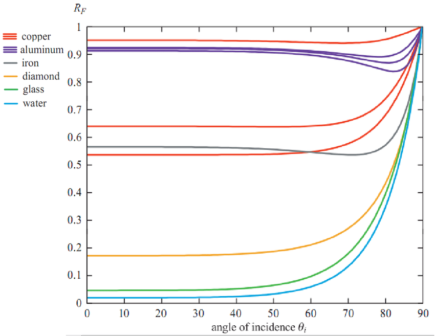
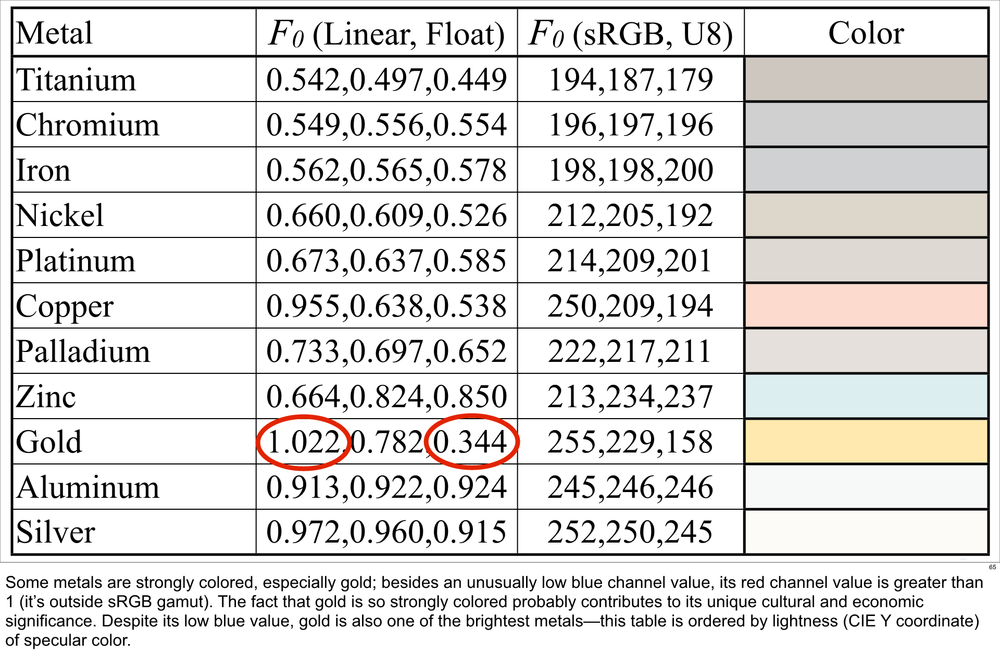
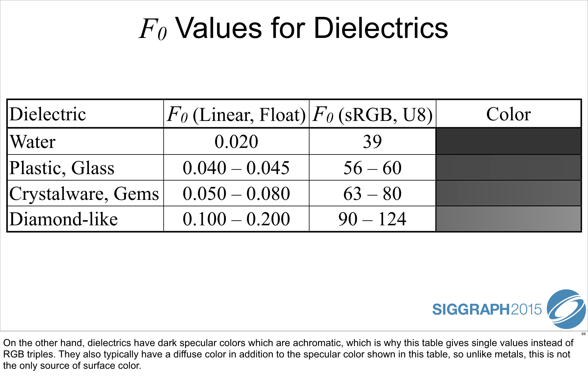

# Computer Graphics

## 수학

### 삼각함수

$\sin^2\theta+\cos^2\theta=1$

$\sin\theta = \cos(\dfrac{\pi}{2}-\theta)$

#### 덧셈

$\sin(x+h) = \sin x\cos h + \cos x \sin h$

#### 삼각함수의 기본 극한

#### L'Hôpital's rule (로피탈의 정리)

#### double angle formula ★

$\sin2\theta = 2\sin\theta\cos\theta$

#### integral ★

##### $\displaystyle \int \sin ax dx = - \dfrac{1}{a} \cos ax + C$

### 기저 함수 basis function

### 편미분

함수 $f(x, y)$ 에 대해

매개변수 $x$ 로만 미분하는 것을 편미분이라고 하며

편도함수(partial derivate)는 $\dfrac{\partial f}{\partial x}$ 와 같다.

이 편도함수 $\dfrac{\partial f}{\partial x}$ 를 다시 $y$ 에 대해 미분하면

이계 편도함수 (second-order partial derivative) $\dfrac{\partial^2 f}{\partial x \partial y}$ 가 된다.

### solid angle 입체각 (단위: steradian == sr, 기호 $\omega,\ \Omega$)

 => $\Omega=\dfrac{A}{r^2}$

​      ($A$는 구 위의 면적, $r$은 구의 반지름)

 => 즉, $A=r^2$ 일 때 $\Omega=1 \ \mathrm{sr}$ 이다.

​      예를 들어 $A=x$ 이면 $\Omega=\dfrac{x}{r^2}$ 이다.

 => 구의 전체 면적은 $4 \pi r^2$ 이므로 구 전체 면적에 대한 입체각은

​       $\Omega_{max}=\dfrac{4 \pi r^2}{r^2}=4 \pi \ \mathrm{sr}$ 이다.

#### ★ 입체각과 구좌표계(spherical coordinates)

### probability density function (확률 밀도 함수)

1. 모든 실수 값 $x$ 에 대해 $f(x) \ge 0$
2. ${\displaystyle \int _{-\infty }^{\infty }f(x)dx=1}$

### dirac delta function

### Spherical Harmonics (SH)

출처:  https://computergraphics.stackexchange.com/questions/4164/what-are-spherical-harmonics-light-probes/4166

 https://en.wikipedia.org/wiki/Table_of_spherical_harmonics#Real_spherical_harmonics 

Fourier transform의 구(Sphere) 버전

polar functions $f(\theta,\phi)$

## 과학

### ★ energy 에너지 (단위: $J$ = joule, 줄) ★

$J=Nm$

  $J$ : joule 줄

 $N$ : Newton 뉴턴

 $m$ : meter 미터

## Radiometry 복사 측정학

출처:  https://www.physics-in-a-nutshell.com/article/20/what-is-radiometry 

 http://www.pbr-book.org/3ed-2018/Color_and_Radiometry/Radiometry.html 

<Newton HIGHLIGHT 21 빛이란 무엇인가?>

### 빛의 분산

태양빛이 프리즘을 통과하면 여러 색깔로 나누어지는데, 이를 빛의 **분산**이라고 한다.

### 파동과 빛의 파장

peak = crest 마루

trough 골

wavelength 파장

빛은 파장의 차이로 인해 색깔의 차이가 발생한다. 빨간색은 파장이 길고, 보라색은 파장이 짧다

### refraction (빛의 굴절)

굴절이 일어나는 이유? 매질에서 빛의 속도가 달라지기 때문

진공에서는 약 30만 km/s, 공기 중에서도 비슷하지만

물 속에서는 약 23만 km/s, 석영 유리 안에서는 약 21만 km/s가 된다 (물이나 유리의 분자가 빛의 진행을 느리게 한다.)

빛의 굴절은 물질에 따라 다르며, 이를 **굴절률(Index of Refraction, IOR)**로 나타낸다.

굴절률이 클수록 해당 물질 속에서 빛의 속도가 느려진다.

#### Snell's Law 스넬의 법칙

##### angle of incidence 입사각

##### angle of refraction 굴절각

입사각을 $\theta_1$ , 굴절각을 $\theta_2$ , 굴절률을 $n$ 이라 할 때

$\dfrac{\sin \theta_1}{\sin \theta_2}=n$ 이 성립한다.

진공 중에서 광속을 $c$, 굴절률이 $n$ 인 물질 속에서 광속을 $v$ 라 하면

$\dfrac{c}{v}=n$ 이 성립한다.

### 난반사

흰 종이 vs. 거울

사과 빨간색

빛이 흡수되면 물질 내에서 사방팔방으로 움직인다 (빛의 산란)

눈에 보이는 물체는 대부분 조명의 일부를 난반사한다. -> 우리가 어디서 보든 그 물체는 보인다

### 전반사

빛이 굴절률이 큰 물질에서 작은 물질로 나아갈 때 입사된 빛이 100% 반사되는 현상?

전반사가 일어나기 시작하는 각도 = 임계각 (물의 경우 48도)

### 파동의 간섭

### electromagnetic wave 전자기파

진공 중 전자기파의 속도 $c$ 는 상수로,

$c=3.0 \times 10^8 m/s$ 이다.

이때 $c=v\lambda$ 이다.

  => $v$ : 진동수

​       $\lambda$ : 파장

### photon 광자

광자의 에너지 $E$ 는 진동수 $v$에 대해 **플랑크(Planck) 상수** $h$ 만큼 비례한다.

$E=hv=\dfrac{hc}{\lambda}$

### radiation

Radiation refers to energy that is transported by means of photons/electromagnetic waves

### radiant energy (단위: $J$)

전자기파의 에너지  energy of electromagnetic waves 

$Q=\dfrac{hc}{\lambda}$

$h$ 플랑크 상수

$c$ 빛의 속력 상수

$\lambda$ 파장

 => 사실 우리는 이 파장 중에 가시광선 파장 (약 380nm ~ 770 nm)만 신경쓰면 된다

### Spectral Power Distribution (SPD)

### ★ radiant flux (= radiant power, 복사 출력, 표기: $\Phi$, 단위: $W$)

#### 단위 시간($1 \text{s}$) 당 방출되는 전자기파 에너지($Q$)의 양

#### $\displaystyle \Phi = \dfrac{Q}{t} = \dfrac{dQ }{dt}$

  => 쉽게 말해, **빛이 1초 동안 얼만큼의 에너지를 방출하는가?** 이다.

  => 정말 단순화해서 생각하자면 초당 방출되는 광자의 개수라고 생각하면 된다!

어떤 광원이 1시간($3,600s$) 동안 총 $200,000J$의 에너지를 방출했고, 단위 시간 당 방출되는 에너지의 양이 일정했다면 (즉, 상수였다면) 이때 광원의 복사 출력은 다음과 같다.

​       $\Phi=\dfrac{200,000J}{3,600s} \approx 55.6 W$

만약 $\Phi$ 가 시간에 대한 함수로 주어지면

일정 시간($t_0$ 에서 $t_1$ 까지) 동안 에너지 $Q$는

$\displaystyle Q=\int_{t_0}^{t_1}{\Phi(t) \text{d} t}$  이다.

 => 적분을 뜻풀이하자면 .. $\Phi(t)$ 를 **시간에 대해 잘개 쪼개서**($\text{d}t$) **다 더하는 것**($\displaystyle \int$) 이다. ★

### irradiance (복사 조도, 표기: $E$)

#### ★단위 면적($1 \text{m}^2$) 당 표면이 받는 복사 출력 $\Phi$ 의 양

  => 입사광이 단위 시간 동안 단위 면적으로 내뿜는 에너지!

  => 입체각과 상관 없으므로 모든 각도에서 들어오는 빛의 양!!

#### $E=\dfrac{\Phi}{A}=\dfrac{d\Phi}{dA}$ 

그림을 보자.

전체 면적(짙은 초록색)에 단위 시간($1\text{s}$) 동안 총 $2.5\text{W}$ 의 복사 출력 $\Phi=2.5\text{W}$ 이 도달한다고 해보자.

짙은 사각형의 가로 길이가 $4\text{m}$이고, 세로 길이가 $3\text{m}$라고 할 때,

전체 면적은 $A=3 \times 4=12\text{m}^2$ 이다.

이때, 단위 면적 ($1\text{m}^2$) 에 대한 복사 출력인 복사 조도 $E_e$ 는

$E = \dfrac{\Phi}{A}=\dfrac{2.5\text{W}}{12\text{m}^2} = 0.2083 \text{W/m} ^2$ 이다.

### radiant intensity (복사 강도, 표기: $I$)

#### 단위 입체각($1\text{sr}$) 당 복사 출력($\Phi$)

#### $I = \dfrac{\Phi}{\omega} = \dfrac{d\Phi}{d\omega}$ 

복사 강도 $I$ 는 단위 입체각($\hat{\omega}=1sr$) 당 복사 출력($\Phi$)을 말한다.

구 전체에 대한 입체각은 $\omega_{max} = 4 \pi \text{sr}$ 이므로

단위 입체각에 대한 복사 출력은 $I=\dfrac{\Phi}{4 \pi}$ 가 된다.

### ★ radiance (복사 휘도, 표기: $L$) ★

#### 입체각에 수직인 표면에 대해, 단위 면적 및 단위 입체각 당 방사되는 복사 출력($\Phi$)의 양

  => 특정 입체각에 대해, 점에서 눈으로 향하는/빛에서 점으로 향하는 빛의 양

#### $L = \dfrac{\Phi}{\omega A^\perp} = \dfrac{d^2 \Phi}{ d\omega dA_{\perp}}$  

  => 이때 $A^\perp = A \cos\theta$ 이다.

  => 거리가 멀어져도 radiance는 달라지지 않는다!★

$L = \dfrac{d^2 \Phi}{ d\omega dA_{\perp}}$  는 공간 상의 점에 대해 특정 방향을 향하는 복사 휘도를 의미한다!

### ★★ radiance $L$ & irradiance $E$ ★★

#### ★ $\displaystyle E = \int L \cos\theta d\omega$

  => 복사 휘도 $L$ 은 $L = \dfrac{d^2 \Phi}{ d\omega dA \cos\theta}$ 로 정의된다. **(그냥 나누기 아니고 미분!)**

​        이때 복사 휘도 $L$ 을 $\omega$ 에 대해 적분하면

​        $\displaystyle \int L d\omega = \dfrac{d\Phi}{dA \cos\theta}$ 이다.

​        $\cos\theta$는 상수이므로 양변에 곱하면

​        $\displaystyle \int L \cos\theta d\omega = \dfrac{d\Phi}{dA}$  이고,

​        복사 조도 $E$ 는 $E = \dfrac{d\Phi}{dA}$ 로 정의되므로

​        $\displaystyle E = \int L \cos\theta d\omega$ 이다! ★★

#### diffuse light의 radiance와 irradiance

컴퓨터 그래픽스에서 사용할 입체각의 범위는 보통 상반구(upper hemisphere)로 한정된다

(하반구에서 오는 빛은 평면에 의해 차단된 것으로 생각하자!)

diffuse light는 반구의 모든 방향으로 동일하게 퍼져나가는 빛이다.

따라서 복사 조도($E$)와 복사 휘도($L$)의 관계식 $\displaystyle E = \int L \cos\theta d\omega$ 에서

적분할 $\omega$의 범위는 반구 전체 ($\omega \in \Omega$, $\Omega=hemisphere$) 이다.

$\displaystyle E = \int_{\Omega}L \cos\theta d\omega$

이때 입체각을 구좌표계로 나타내면

  $d\omega = \sin(\theta) d\theta d\phi$

  (단, $\theta=[0,\dfrac{\pi}{2}], \phi=[0,2\pi]$)   이므로

$\displaystyle E = \int_{0}^{\frac{\pi}{2}} d\theta \int_{0}^{2 \pi} L \cos\theta \sin\theta d\phi$ 이다.

여기서 $\phi$ 는 어떤 함수에도 매개변수가 아니고 $\displaystyle \int_{0}^{2 \pi}  d\phi = 2\pi$ 이므로

$\displaystyle E = 2\pi \int_{0}^{\frac{\pi}{2}} L \cos\theta \sin\theta d\theta$ 이다.

이때, 삼각함수의 **double angle formula**에 의해

  $2\cos\theta\sin\theta=sin(2\theta)$ 이므로

$\displaystyle E = \pi \int_{0}^{\frac{\pi}{2}} L \sin(2\theta) d\theta$ 이다.

이제 $\sin$ 함수에 대해 적분을 하면

$E = \pi \left[-\dfrac{1}{2} \cos(2\theta) \right]_0^{\frac{\pi}{2}} L d\theta$ 이고,

$\left[-\dfrac{1}{2} \cos(2\theta) \right]_0^{\frac{\pi}{2}} = -\dfrac{1}{2} \cos\pi -\left( -\dfrac{1}{2} \cos0 \right) = 0 - (-1) = 1$  이므로

$E = \pi L$  이고, $L=\dfrac{E}{\pi}$ 이다.

그러나 실제로 표면이 모든 빛을 반사(rgb 1, 1, 1)하는 것이 아니므로, $\rho$ (albedo) 값을 곱해

$L_o = \dfrac{\rho E}{\pi}$ 이다.

#### specular light의 radiance와 irradiance

specular light는 반구 전체 방향에서 들어오는 빛에 대해, 한 방향으로만 반사되는 빛을 말한다.

따라서 복사 조도($E$)와 복사 휘도($L$)의 관계식 $\displaystyle E = \int L \cos\theta d\omega$ 에서

적분할 $\omega$의 범위는 반구 전체 ($\omega \in \Omega$, $\Omega=hemisphere$) 이다.

 ==> $L=\dfrac{E}{\pi}$

이때 특정 방향에 대한 복사 휘도 $L$  중에서 성공적으로 반사되는 빛의 비율을

함수 $f_r$ 라고 정의하면, $L_s = f_rL$ ($L_s$ 는 specular light의 복사 휘도)

$L_s = f_rL = \dfrac{f_rE}{\pi}$

즉, $L_s = \dfrac{f_rE}{\pi}$ 이다.

### attenuation 감쇠

거리가 멀수록 빛의 양이 줄어든다..! 거리의 제곱에 반비례해서

### index of refraction (IOR) 굴절율? 굴절지수?

matt = mat = matte 무광

### scattering 산란: 전자기파가 기존과 다른 방향으로 움직임

#### transmission 투과

 cf) transmittance 투과율

#### absorption 흡수

#### reflectance 반사 == diffuse reflection + specular refelction

 => albedo는 [0, 1]의 값을 가지며, 0일 경우 모든 입사광을 흡수, 1일 경우 모든 입사광을 반사한다는 뜻이다. (단위 면적 당 광속이 반사되는 양?)

### light (source) 광원

#### punctual light 점 광원

#### area light 영역 광원

participating medium 참여 매질

(light) emission (빛의) 방출

optical depth 광학적 깊이

spectral power distribution (SPD)

index of refraction (IOR)

 => 매질을 지나는 빛의 속도 & 매질이 흡수하는 빛의 양

### Light propagation 빛의 전파

특정 참여 매질에 대한 빛의 전파는 산란(scattering), 흡수(absoprtion), 방출(emission)으로 설명된다.

각각의 계수는 $\beta_\mathrm{Sc}$, $\beta_\mathrm{Ab}$, $\beta_\mathrm{Em}$ 로 나타낸다.

광 소멸(light extinction) 계수는

$\beta_\mathrm{Ex}=\beta_\mathrm{Sc}+\beta_\mathrm{Ab}$ 과 같다. (흡수와 산란으로 인한 에너지 손실을 의미한다.)

#### 광학적 깊이 (optical depth)

광학적 깊이 $\tau$ 는

두 지점 $\bold{P_0}$, $\bold{P_1}$ 사이의 광 소멸 계수 $\beta_\mathrm{Ex}$를 거리에 대해 적분한 것과 같다.

$\displaystyle \tau(\bold{P_0,P_1})=\int_A^B{\beta(\bold{P})ds}$

이때, $\bold{P}=\bold{P_0}+\bold{r}s$ 이고,

$\displaystyle \bold{r}=\dfrac{\bold{P_1-P_0}}{\|\bold{P_1-P_0}\|}$ , $s$는 $\bold{P_0}$과 $\bold{P}$ 사이의 거리이다.

광학적 깊이가 $\tau$인 매질을 지나는 빛은 그 세기가 $e^{-\tau}$ 의 곱만큼 줄어든다.

## HDR (High Dynamic Range)

https://learnopengl.com/Advanced-Lighting/HDR 

https://gamedev.stackexchange.com/questions/62836/does-hdr-rendering-have-any-benefits-if-bloom-wont-be-applied 

https://github.com/nothings/stb => stb_image.h

### LDR (Low Dynamic Range)

### Tone mapping (HDR -> LDR)

#### Reinhard tone mapping

#### Exposure tone mapping

## PBR (Physically Based Rendering, 물리 기반 렌더링)

참고:	https://learnopengl.com/PBR/Theory

​			http://www.codinglabs.net/article_physically_based_rendering.aspx 

​			https://github.com/bartwronski/CSharpRenderer/blob/master/shaders/optimized-ggx.hlsl

​			https://computergraphics.stackexchange.com/questions/8658/ggx-brdf-is-greater-than-1

​			https://github.com/Nadrin/PBR/blob/master/data/shaders/hlsl/pbr.hlsl ★

​			https://google.github.io/filament/Filament.html

​			http://pauldebevec.com/ 

​			https://wiki.jmonkeyengine.org/jme3/advanced/pbr_part1.html 

​			https://seblagarde.wordpress.com/2014/04/14/dontnod-physically-based-rendering-chart-for-unreal-engine-4/ 

​			http://artisaverb.info/PBT.html 

​			https://docs.unrealengine.com/en-US/Engine/Rendering/Materials/PhysicallyBased/index.html

​			https://www.trentreed.net/blog/physically-based-shading-and-image-based-lighting/ (실제 이미지 예시 포함)

​			https://blog.selfshadow.com/publications/ ★(SIGGRAPH)

​			http://renderwonk.com/publications/s2010-shading-course/ (SIGGRAPH 2010)

​			https://blog.selfshadow.com/publications/s2012-shading-course/ (SIGGRAPH 2012)

​			https://blog.selfshadow.com/publications/s2013-shading-course/#course_content 

 https://placeholderart.wordpress.com/2015/07/28/implementation-notes-runtime-environment-map-filtering-for-image-based-lighting/ 

 https://chetanjags.wordpress.com/2015/08/26/image-based-lighting/ 

 https://marmoset.co/posts/physically-based-rendering-and-you-can-too/
https://marmoset.co/posts/pbr-texture-conversion/

 http://gl.ict.usc.edu/Data/HighResProbes/ 

### 용어

(texture) splatting 여러 레이어의 텍스쳐를 결합!

LUT (Look-Up Texture)

specular lobe: 혹

#### albedo

전체 태양 빛 중 얼만큼의 빛을 diffuse reflection 하는지에 대한 비율. RGB로 나타냈을 때 (0, 0, 0)이면 검정색, (1, 1, 1)이면 하얀색이라는 뜻이다.

예를 들어, albedo가 (0.3, 0.5, 0.7)인 표면은 하얀색 빛(RGB: r, g, b)이 표면에 도달했을 때, 총 (0.3r, 0.5g, 0.7b) 만큼의 빛을 diffuse reflection 한다!

### energy conservation

### Microfacet theory (미세면 이론)

미세면 이론: 모든 표면(surface)은 아주 가까이서 살펴보면 작은 거울(완전 평평하고, 빛을 반사만 시킨다)의 모임으로 이루어져 있다.

표면이 거칠면(rough) 이 작은 면들이 들쑥날쑥하게 배치되어 있는 것이고, 표면이 부드러우면(soft) 평평하게 배치되어 있는 것이다.

거친(rough) 표면이어도, grazing angle에서는 거울에 가까워진다! (Fresnel reflectance)

금속은 refracted lights를 전부 다 흡수해버린다!

### rendering equation ★

$L$ radiance

$L_i$ incoming radiance

$L_e$ emitted radiance

$L_o$ outgoing radiance

$\displaystyle L_o(\bold{x},\ \omega_o, \lambda, t) = L_e(\bold{x},\ \omega_o, \lambda, t) + \int_{\Omega}{f_r(\bold{x}, \omega_i, \omega_o, \lambda, t) L_i(\bold{x}, \omega_i, \lambda, t) (\omega_i \cdot n) d\omega_i}$

   $\bold{x}$ : 공간 내 위치

   $\bold{n}$ : macrosurface의 법선(normal)

   $\lambda$ : 파장(wavelength)

​    $t$ : 시간

   $\Omega$ : 단위 반구(unit hemisphere)

   $\omega_i$ : 입사되는 빛의 방향

   $\omega_o$ : 방사되는 빛의 방향

   $f_r(\bold{x}, \omega_i, \omega_o, \lambda, t)$ : **BRDF**

#### ★★ reflectance equation ★★

##### $\displaystyle L_o = \int_{\Omega}{f_r(\omega_i, \omega_o) L_i \omega_i \cdot n d\omega_i}$

rendering equation에서 위치, 파장, 시간을 무시하자.

(위치는 항상 반구의 중앙으로 잡고, 파장은 어차피 rgb로 한정되어 있고, 시간은 frame 단위로만 볼 것이므로)

$\displaystyle L_o = L_e + \int_{\Omega}{f_r(\omega_i, \omega_o) L_i \omega_i \cdot n d\omega_i}$

reflectance equation에서는 표면에서 방출되는 빛은 없다고 가정한다. (발광 표면을 고려하지 않음..)

$\displaystyle L_o = \int_{\Omega}{f_r(\omega_i, \omega_o) L_i \omega_i \cdot n d\omega_i}$

### BRDF (Bidirectional Reflectance Distrubution Function)

http://graphicrants.blogspot.com/2013/08/specular-brdf-reference.html 

BRDF 계산한다고 끝이 아니다..! BRDF는 rendering equation의 일부일 뿐!!! ★

#### 용어

$n$ : macrosurface의 법선

$m$ : microsurface의 법선

$l$ : macrosurface 위의 한 점에서 빛의 방향으로 향하는 단위 벡터

$v$ : macrosurface 위의 한 점에서 눈의 방향으로 향하는 단위 벡터

$h$ : $l$ 과 $v$ 의 중간을 향하는 단위 벡터

(참고: 미세면의 법선은 $m$ 이지만, 이 중에 빛이 눈에 도달하는 경우는 $m = h$ 일 때 뿐이다! ★★)

$f(l,v) = k_d f_{diff} + k_s f_{spec}$ 

  => $k_d + k_s = 1$ (각각 재질의 diffuse 색상과 specular 색상이다. 두 색상이 다를 수 있음!)

  => 금속일 경우 $k_d=0$ 이어야 한다! (금속은 specular만!)

금속성(metalness)를 $k_m = [0, 1]$  이라 할 경우

$f(l,v) = lerp(k_d f_{diff},\ k_s f_{spec},\ k_m)$  이라고 할 수 있다?

#### Diffuse BRDF

##### Lambertian diffuse BRDF

diffuse light의 radiance는 전체 irradiance를 $\pi$ 로 나눈 값이다.

$f_{diff}(l,v)=\dfrac{\rho_d}{\pi}$

 => 빛이 반사되는 방향에 상관 없이 상수..! (diffuse 자체의 정의)

 => $\rho_d$ 는 diffuse albedo (r, g, b) 

 => 에너지 보존법칙을 지키기 위해 $\pi$ 로 나눠야 한다. (어느 한 방향에 대한 값이 아니고, 반구 내 모든 방향에 대한 값이기 때문에 $\pi$로 나눈다 <= 적분으로 증명)

##### Harahan-Krueger diffuse BRDF

 => 피부 subsurface scattering 구현할 때 쓰자

#### Specular BRDF

참고:	http://graphicrants.blogspot.com/2013/08/specular-brdf-reference.html 

​			https://docs.unrealengine.com/en-US/Engine/Rendering/Materials/PhysicallyBased/index.html 

​			http://filmicworlds.com/blog/everything-is-shiny/ 

##### Cook-Torrance specular BRDF

$f_{spec}(l, v) = \dfrac{F(l, m)}{\pi} \dfrac{G(l, v, m) D(m)}{(n \cdot l)(n \cdot v)}$

  => macrosurface의 법선 $n$ 은 주어지므로, 상수값으로 간주한다.

​       microsurface의 법선 $m$ 은 $l$ 과 $v$ 의 half-way 벡터이므로 (l, v)에 대한 상수값으로 간주한다.

​       따라서 $f_{spec}$ 은 빛의 방향 $l$ 과 눈의 방향 $v$ 에 대한 함수다.

##### GGX (and after) specular BRDF

$f_{spec}(l, v) = \dfrac{F(l, m)G(l, v, m)D(m)}{4(n \cdot l)(n \cdot v)}$

  => 분모의 $4$ 는 Cook-Torrance BSDF의 $\pi$ 에 해당한다.

##### $F(l,m)$, Fresnel reflectance function

$F(l,m)$ = fresnel reflectance (반사된 입사광 양 : 굴절된 입사광 양) 

=> 미세면은 모두 거울이므로 굴절을 무시한다!

=> 즉, 미세면에 충돌한 빛 중 몇 퍼센트의 빛이 **반사**되는가를 말해준다. (즉, 재질의 **specular color**를 결정한다!)

=> 입사각이 90도에 가까워질 때에만 급격하게 변화하고, 0~50도까지는 상수에 가까울 정도로 변화가 거의 없다..!

=> 0도에서 50도까지는 0도일 때 값 $F(0^\circ)$ 을 상수로 사용하자!

=> $F_0=F(0^\circ)$

금속의 경우 이 값이 대체로 높고, 비금속(dielectric)의 경우 (그레이 스케일로) 굉장히 낮다...

비금속의 경우 다이아몬드가 흔하지는 않으므로... 대부분 4%정도의 $F_0$ 값을 갖는다고 생각할 수 있으므로 단순화할 수 있다.

하지만 50도 이후에는 변화가 있으므로 이를 approximate할 함수를 찾아야 한다...

###### Schlick Fresnel approximation

$F_{Schlick}$은 $F_0$ ( $F_0 = F(0^\circ)$ 이다.) 을 매개변수로 받는 함수로, 법선 $n$ 에 대해

$F_{Schlick}(F_0, l, n)=F_0+(1-F_0)(1-l \cdot n)^5 \quad \text{where }  l \cdot n = 0,\ \text{if } \ l \cdot n<0$

와 같이 정의된다.

미세면의 법선 $m$ 에 대해서도 동일하므로

$F_{Schlick}(F_0, l, m) = \begin{cases} F_0+(1-F_0)(1-l \cdot m)^5 & \text{where } (l \cdot m > 0) \\ 1 & \text{else } \end{cases}$

와 같이 정의할 수 있다.

이때 $l=m$ 라면 (즉, 입사각이 0도라면)  $l \cdot m=1$ 이므로 $F_{Schlick}=F_0$ 이 성립함을 확인할 수 있다!

입사각이 90도라면 $l \cdot m = 0$ 이므로 1이다!

###### Cook-Torrance

##### $D(m)$, Normal distribution function (NDF)

**정규 분포가 아니라, 정말로 법선(normal)의 분포를 나타내는 함수이다! ★**

총 미세면 중 얼만큼의 미세면이 눈을 향하고 있는가에 대한 통계적인 수치이다.

 $0 \le D(m) \le \infin$ 을 만족시킨다.

Phong NDF, Blinn-Phong NDF, Beckmann NDF, Trowbridge-Reitz NDF(== GGX NDF) 등등 여러 가지 모델이 있다..

###### Beckmann NDF

$\Lambda(a) \approx \begin{cases}{} \dfrac{1-1.259a+0.396a^2}{3.535a+2.181a^2}, & (a < 1.6) \\ 0, & (a \ge 1.6) \end{cases}$

###### GGX (Trowbridge-Reitz) NDF ★

$D(m)=\begin{cases} \dfrac{\alpha^2}{\pi(1+(n \cdot m)^2(\alpha^2 -  1))^2} & \text{where } n \cdot m > 0 \\ 0 & \text{else} \end{cases}$

  => $\alpha$ 는 표면의 거침(roughness)을 나타내는 매개변수로,

​       $\alpha = r^2$로 두고 $r$을 0에서 1사이의 선형 값으로 지정하는 것이 좋다

GGX NDF는 shape-invariant이므로 람다 함수가 단순하다

 => $\Lambda(a) = \dfrac{-1+\sqrt{1+\frac{1}{a^2}}}{2}$

 이때, $a=\dfrac{n \cdot s}{\alpha\sqrt{1-(n \cdot s)^2}}$ 이다. (s는 l 또는 v이다.)

 

##### $G(l, v, m)$ Geometry function

shadowing-masking function이라고도 불린다

전체 미세면 중 가리거나 그늘지지 않은 미세면(즉, 눈까지 빛을 도달시키는) 미세면의 비율이다.

물리적으로는 미세면의 법선이 halfway vector여도 가려지거나(masked) 그늘지면(shadowed) 빛이 눈까지 오지 못할 수도 있고, 올 수도 있다...!!

###### 1) 비율이므로 $0 \le G(l, v, m) \le 1$ 을 만족시킨다. ★

###### 2) (양방향에 대해) 대칭이기 때문에 $G(l, v, m) = G(v, l, m)$ 를 만족시킨다. 

###### 3) macrosurface가 뒷면이거나 microsurface가 뒷면이면 보이지 않으므로 $(l \cdot m)(l \cdot n) \le 0$ 이거나 $(v \cdot m)(v \cdot n) \le 0$ 일 경우 $G(l, v, m)=0$ 이다.

여러 함수가 있지만 Smith G 함수가 제일 수학적으로/물리적으로 괜찮은 듯? (by Eric Heitz)

###### Cook-Torrance

$G(l, v, h) = min(1, \dfrac{2(n \cdot h)(n \cdot v)}{v \cdot h}, \dfrac{2(n \cdot l)(n \cdot v)}{v \cdot h})$

###### Smith★

$G_2(l, v, n) = G_{1}(n,l)G_{1}(n,v)$

 => $G_1$은 단방향에 대한 가시성(visibility)이다.

​       $G_2$는 양방향에 대한 가시성!

 => $G_1(s) = \dfrac{n \cdot s}{(n \cdot s)(1-\alpha) + \alpha}$

​      => $s$ 는 $l$ 또는 $v$ 이고, $n$ 은 macrofacet의 법선이다.

근사값 계산

 => $G_1(s) \approx \dfrac{2(n \cdot s)}{(n \cdot s)(2-\alpha) + \alpha}$ (s는 l 또는 v이다.)

 => $G(l,v,n) \approx \dfrac{2(n \cdot l)}{(n \cdot l)(2-\alpha) + \alpha} \times \dfrac{2(n \cdot v)}{(n \cdot v)(2-\alpha) + \alpha}$

 => $\dfrac{G(l, v, n)}{4|n \cdot l||n \cdot v|} \approx \dfrac{0.5}{lerp(2|n \cdot l||n \cdot v|, |n \cdot l| + |n \cdot v|, \alpha)}$

macrosurface의 BRDF는 microsurface의 BDRF를 적분하여 얻을 수 있다

### Diffuse roughness와 Specular roughness

Specular roughness보다 Diffuse roughness가 훨씬 덜 정교하고, 변화가 덜하다

### Image Based Lighting (IBL)

옛날 ambient를 보다 정확히 (환경맵을 이용해) 구현하는 방법!

https://www.indiedb.com/features/using-image-based-lighting-ibl

http://jacquesdiringer.blogspot.com/2017/08/ambient-lighting-for-pbr-materials.html

http://graphics.stanford.edu/papers/envmap/ 

DirectX Texture Tool (64-Bit) (DirectX SDK) => cube map

https://developer.nvidia.com/nvidia-texture-tools-adobe-photoshop

https://github.com/Microsoft/DirectXTex/wiki/Texassemble 

 https://github.com/derkreature/IBLBaker 

 https://www.trentreed.net/blog/physically-based-shading-and-image-based-lighting/ 

illumination map (irradiance map) -> 한 점에 입사되는 모든 빛

reflection map -> illumination map을 흐리게(blur) 

#### environment map

 https://docs.unity3d.com/Manual/class-Cubemap.html 

원경의 특정 방향에서 오는 빛을 담아두는 cube map 텍스처를 말한다. (즉, environment map에는 원경의 radiance 값이 저장되어 있다. 다시 말해, **아주 많은 수의 광원**이 저장되어 있다...!!!)

#### irradiance map

environment map이 원경의 radiance를 담고 있으니

**반구(hemisphere)** 위의 각 점에 대해, 각 점이 모든 빛을 반사한다고 가정하면(r:1.0 g:1.0 b:1.0) 각 점에 대해 모든 방향에서 오는 radiance 정보를 샘플하여 적분하면 해당 점의 irradiance를 구할 수 있다! (accurate)

  => $\displaystyle E = \int L \cos\theta d\omega$ 이므로

하지만 모든 방향을 sample하는 것은 비용이 높고, 또 일정 sample 횟수를 넘어가면 quality 차이가 크지 않을 것이므로... 샘플 횟수를 좀 줄여보자 (approximation)
=> **Riemann sum**을 활용 (특정 방향에서 빛이 더 들어올 이유가 없으므로 가중치가 필요하지 않다)

혹은 spherical harmonics 활용??

**CONVOLVE** cubemap에서 irradiance_map을 만들자
integral이 아니므로 각 radiance 값을 모두 더한 후 평균을 구한다! 즉, 총 sample 수(polar_count * azimuth count)로 나눠야 한다!!
=> cube map 뷰어 + irradiance map 생성기 ★★★
 => irradiance map은 blur된 것처럼 detail이 줄어드니까... 해상도 낮춰서 저장하고, 쓸 때는 linear filtering으로 샘플하면 되겠다!

#### diffuse IBL

https://learnopengl.com/PBR/IBL/Diffuse-irradiance 

diffuse light는 모든 방향에서 입사되는 빛이 모든 방향으로 반사된다. 즉, 우리가 원하는 특정 점에서 반사되는 빛은? 모든 방향에서 입사되었다.

diffuse light의 radiance는 $L=\dfrac{E}{\pi}$ 와 같이 구할 수 있으므로,

따라서 irradiance map을 샘플하여 $\pi$ 로 나누고, albedo만 곱하면 된다(각 점이 실제로 r:1.0 g:1.0 b:1.0를 반사하는 게 아니므로)

#### specular IBL

 http://holger.dammertz.org/stuff/notes_HammersleyOnHemisphere.html 

direct light의 specular는 해당 direct light 하나에 대해 계산하면 됐지만... indirect light의 specular는 계산해야 할 방향이 정말 많다! 그러니 샘플 횟수를 줄여보자

주의할 점은 모든 방향에서 입사되는 빛이 모든 방향으로 반사되는 diffuse light와는 달리... specular light는 특정 방향에서 더 많은 빛이 입사된다! => **specular lobe**

importance sampling

 => 다 sample할 필요 없다.. 어차피 m 벡터에 가깝게만 반사되니까?

 Monte Carlo integration 

#### HDRi & equirectangular map

https://matheowis.github.io/HDRI-to-CubeMap/ 

어쨌든 HDRi를 실시간으로 투영해서 sample하는 것보단 전통 cubemap 방식이 빠르다... cubemap은 그냥 구의 좌표를 정규화한 벡터에 대해 1:1 대응이니까