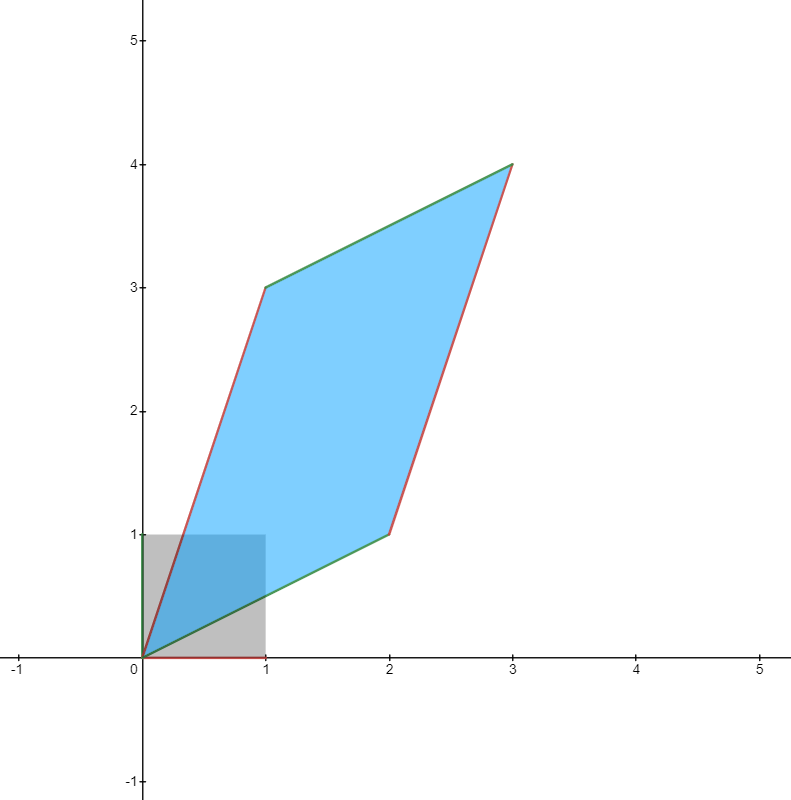

# Linear Algebra 선형대수학

## 1. vector 벡터

벡터는 **변환(transformation)**의 일종이다!! 위치가 아니라 **이동값**이다!!! 그래서 좌표처럼 표기하면 헷갈린다..
$$
(1, 2) \ne [ 1 ,\ 2 ]
$$

점 $A$ 에서 $B$ 까지의 벡터를 $\vec{AB}$ 로 표기하고, $A$ 를 **initial point (시점)**, $B$ 를 **terminal point (종점)** 이라고 한다.

이때 시점이 원점에 있는 벡터를 **standard position (표준 위치)** 에 있다고 한다.

보통 벡터는 $\bold{v}$ 와 같이 굵은 글씨 소문자로 나타낸다.

### component 성분

### row vector = column vector

$$
[1, 2] = \begin{bmatrix}1 \\ 2\end{bmatrix}
$$

### zero vector 영벡터

$$
\bold{0}
$$

### 기본 연산 #1 - vector addition (벡터 덧셈)

$$
\bold{u} + \bold{v} = [u_1 + v_1,\ u_2 + v_2]
$$

#### 순서가 상관 없다!!!! (기하학적으로도!!!)

#### parallelogram law 평행사변형 법칙

### 기본 연산 #2 - scalar multiplication (스칼라배)

$$
c\bold{v} = c[v_1,\ v_2] = [cv_1,\ cv_2]
$$

#### parallel 평행

두 벡터가 스칼라배일 필요충분조건은 두 벡터가 평행인 것이다.

#### negative vector & difference 음벡터와 차

$$
(-1)\bold{v} = -\bold{v}
$$

$$
\bold{u} - \bold{v} = \bold{u} + (-\bold{v})
$$

### $\R^n$ 으로 확장

벡터로 표시된 $n$ 개 실수의 순서쌍의 집합을 $\R^n$ 로 나타낸다.

$\R^n$ 에 있는 벡터 $\bold{v}$ 는
$$
[v_1,\ v_2,\ \cdots,\ v_n] = \begin{bmatrix}v_1 \\ v_2 \\ \vdots \\ v_n\end{bmatrix}
$$
의 형태가 된다.

이때 $3 < n$ 이면 벡터를 시각화하는 것은 불가능하다. 따라서 대수적 연산을 할 수 있다는 사실이 더욱 중요하다.

#### $\R^n$ 내 벡터의 대수적 성질

$\bold{u}, \bold{v}, \bold{w}$ 가 $\R^n$ 의 벡터들이고, $c, d$ 가 스칼라일 때
$$
\begin{align}
&\text{a. } \bold{u} + \bold{v} = \bold{v} + \bold{u} \\
&\text{b. } (\bold{u} + \bold{v}) + \bold{w} = \bold{u} + (\bold{v} + \bold{w}) \\
&\text{c. } \bold{u} + \bold{0} = \bold{u} \\
&\text{d. } \bold{u} +(-\bold{u}) = \bold{0} \\
&\text{e. } c(\bold{u} + \bold{v}) = c\bold{u} + c\bold{v} \\
&\text{f. } (c + d)\bold{u} = c\bold{u} + d\bold{u} \\
&\text{g. } c(d\bold{u}) = (cd)\bold{u} \\
&\text{h. } 1\bold{u} = \bold{u} \\
\end{align}
$$

### linear combination 선형결합

$$
\bold{v} = c_1\bold{v_1} + c_2\bold{v_2} + \cdots + c_n\bold{v_n}
$$

을 만족하는 스칼라 
$$
c_1, c_2, \cdots, c_n
$$
가 존재하면

$\bold{v}$ 를

$\bold{v_1}, \bold{v_2}, \cdots, \bold{v_n}$ 의 **linear combination (선형 결합)** 

이라고 한다.

이때 스칼라 $c_1, c_2, \cdots, c_n$ 를 이 선형 결합의 **coefficient (계수)** 라고 한다.

### scalar product (스칼라적) = dot product

$$
\bold{u} = \begin{bmatrix}u_1 \\ u_2 \\ \vdots \\ u_n\end{bmatrix},\ \bold{v} = \begin{bmatrix}v_1 \\ v_2 \\ \vdots \\ v_n\end{bmatrix}
$$

일 때
$$
\bold{u} \cdot \bold{v} = u_1v_1 + u_2v_2 + \cdots + u_nv_n
$$
을 스칼라적이라고 한다. 이때 두 벡터는 반드시 성분의 개수가 같아야 한다!

#### 정리

$$
\begin{align}
&\text{a. } \bold{u} \cdot \bold{v} = \bold{v} \cdot \bold{u} \\
&\text{b. } \bold{u} \cdot (\bold{v} + \bold{w}) = \bold{u} \cdot \bold{v} + \bold{u} \cdot \bold{w} \\
&\text{c. } (c\bold{u}) \cdot \bold{v} = c(\bold{u} \cdot \bold{v}) \\
&\text{d. } \bold{u} \cdot \bold{u} \ge 0 \text{ 이다. 그리고 } \bold{u} \cdot \bold{u} = 0 \text{ 이기 위한 필요충분조건은 } \bold{u} = \bold{0} \text{ 이다.} \\
\end{align}
$$

### norm = length

#### unit vector

단위원! unit circle

#### normalization

### Cauchy-Schwarz inequality (코시-슈바르츠 부등식)

### distance between vectos

$$
\text{d}(\bold{u}, \bold{v}) = ||\bold{u} - \bold{v}||
$$

### orthogonality 직교

$\R^n$ 의 두 벡터 $\bold{u}, \bold{v}$ 에 대해
$$
\bold{u} \cdot \bold{v} = 0
$$
일 때 두 벡터는 서로 **orthogonal (직교)** 이다.

#### zero vector and orthogonality

위에서 서술한 직교의 정의에 의해 영벡터는 모든 벡터에 직교한다!!

### projection 사영

$$
\text{proj}_{\bold{u}}(\bold{v})
$$

### 

### @@@ TODO: 직선과 평면 ... 

## 2. 행렬 matrix

**차원 변환기!!**

$$
\begin{bmatrix}
1 & 0 \\
0 & 1
\end{bmatrix}
$$

## linear equation 선형방정식

$n$ 개의 미지수 $x_1, x_2, \cdots, x_n$ 에 대해
$$
a_1x_1 + a_2x_2 + \cdots + a_nx_n = b
$$

로 표기되는 방정식을 **linear equation (선형방정식)** 이라고 한다.

이때 $a_1, a_2, \cdots, a_n$ 등 **coefficient (계수)** 와 상수항 $b$ 는 **constant (상수)**이다.

#### 예시

$$
2x_1 -5x_2 = 7
$$

#### solution 해

일차방정식
$$
a_1x_1 + a_2x_2 + \cdots + a_nx_n = b
$$
의 **solution (해)** 는
$$
x_1  = s_1,\ x_2 = x_2,\ \cdots,\ x_n = s_n
$$
을 대입할 때 방정식을 만족하는 벡터
$$
[s_1,\ s_2,\ \cdots,\ s_n]
$$
이다.

### system of linear euqations 선형방정식계 (= 선형계, 연립일차방정식)

#### 정의

하나 이상의 선형방정식의 모임
$$
a_{11}x_1 + a_{12}x_2 + \cdots + a_{1n}x_n =b_1 \\
a_{21}x_1 + a_{22}x_2 + \cdots + a_{2n}x_n =b_2 \\
\vdots \\
a_{m1}x_1 + a_{m2}x_2 + \cdots + a_{mn}x_n =b_m \\
$$

#### 예시

$$
x_1 - x_2 = 3 \\
2x_1 + 3x_2 = 6
$$

#### solution 해

변수 $x_1, x_2, \cdots, x_n$ 에 대입했을 때 모든 식이 참이 되도록 하는 숫자들 $s_1, s_2, \cdots, s_n$ 

##### solution set 해집합

선형계의 모든 해의 집합

두 선형계가 같은 해집합을 갖는다 = 두 선형계는 **equivalent (동치)** 이다

##### 실수 계수 선형계의 해집합

1. 해를 갖지 않는다. (두 직선이 교차하지 않음)			=> **consistent (모순이 없음)**
2. 단 하나의 해를 갖는다. (두 직선이 한 점에서 만남)  => consistent
3. 무수히 많은 해를 갖는다. (두 직선이 평행함)			=> **inconsistent (불능)** 

## 선형계 풀이

#### 핵심 알고리즘: 풀기 쉬운 동치의 선형계로 바꾼다

$$
3x_1 +x_2 =4 \\
x_1 + 5x_2 = 9
$$

### 행렬표기법

#### coefficient matrix 계수행렬

$$
3x_1 +x_2 =4 \\
x_1 + 5x_2 = 9 \\
\rightarrow

\begin{vmatrix}
3 & 1 \\
1 & 5
\end{vmatrix}
$$

#### augmented matrix 첨가행렬

$$
3x_1 +x_2 =4 \\
x_1 + 5x_2 = 9 \\
\rightarrow
\begin{vmatrix}
3 & 1 & 4\\
1 & 5 & 9
\end{vmatrix}
$$

#### row echelon form 행사다리꼴

### elementary row operation (기본 행연산, 기본 행변환)

#### 가역적이다!!!

#### row reduction (행 축약, 행 줄임)

#### leading entry 선행 성분: 가장 왼쪽의 0이 아닌 성분

##### pivot position 추축 위치

##### pivoc column 추축열

#### 행 동치 row equivalent - 행 연산을 통해 같아질 수 있는 두 행렬

#### reduced row echelon form (RREF) 기약행사다리꼴 => 오로지 하나!(UNIQUE)

$$
\begin{vmatrix}
1 & 0 & 0 & 2\\
0 & 1 & 0 & 3\\
0 & 0 & 1 & 4
\end{vmatrix}
$$

### 선형계의 해

#### 첨가행렬로 보는 선형방정식계 해의 종류

$$
\text{case A:} \ 
\begin{vmatrix} 1 & 1 & 1 \\ 1 & 1 & 0 \end{vmatrix} \\
\text{case B:} \
\begin{vmatrix} 1 & 1 & 1 \\ 1 & 0 & 1 \end{vmatrix} \\
\text{case C:} \
\begin{vmatrix} 1 & 1 & 1 \\ 1 & 1 & 1 \end{vmatrix}
$$

#### 예시

$$
\begin{vmatrix}
1 & 0 & 0 & 2 & 3 & 4 \\
0 & 1 & 0 & 5 & 6 & 7 \\
0 & 0 & 0 & 8 & 9 & 0 \\
0 & 0 & 0 & 0 & 1 & 2 \\
\end{vmatrix}
$$

#### 기본 변수 basic variable

#### 자유 변수 free variable

#### 해의 존재성

#### 해의 유일성

### homogeneous linear system 동차 선형계

각 방정식의 상수항이 0 인 선형계를 동차라고 한다.

## span ★ 생성

### 가능한 모든 ★선형결합★!!!

$\text{span}(\bold{v})$ : v 의 모든 스칼라배의 집합 => 원점을 지나는 직선

$\text{span}(\bold{u}, \bold{v})$ => 원점을 지나는 평면 (근데 u 와 v 가 선형종속이라면 직선이 된다는...) 
$$
\text{span}(\bold{u}, \bold{v}) \in \R^2
$$
 => 벡터 $\bold{u}, \bold{v}$ 가 $\R^2$ 을 **span** (생성)한다.

### standard unit vector 기본 단위 벡터

$$
\bold{e_1}, \bold{e_2}, \cdots, \bold{e_n}
$$

기본 단위 벡터는 $\R^n$ 을 생성한다!! 즉, $\R^n$ 내 어떤 벡터든 기본 단위 벡터의 선형 결합으로 나타낼 수 있다!

## vector equation 벡터 방정식

벡터 $\bold{b}$ 가 다른 벡터들 $\bold{a_1}, \bold{a_2}, \cdots, \bold{a_n}$ 의 span 인지 판단!!!
$$
x_1\bold{a_1} + x_2\bold{a_2} + \cdots + x_n\bold{a_n} = \bold{b}
$$
위 식을 성립하는 $x_1, x_2, ..., x_n$  이 있다면
$$
\bold{b} = \text{span}(\bold{a_1}, \bold{a_2}, \cdots, \bold{a_n})
$$

## matrix equation 행렬방정식

위의 벡터 방정식을 행렬로 표기할 수 있다!!!

**행렬과 벡터의 곱** ( **b 가 A 의 열의 선형결합!**!! )
$$
\bold{a_1}x_1 + \bold{a_2}x_2 + \cdots + \bold{a_n}x_n = \bold{b}
$$

$$
\begin{vmatrix}\bold{a_1} \ \bold{a_2} \ \cdots \ \bold{a_n}\end{vmatrix} \bold{x} = \bold{b}
$$

$$
\begin{vmatrix}
a_{11} & a_{12} & \cdots & a_{1n} \\
a_{21} & a_{22} & \cdots & a_{2n} \\
\vdots \\
a_{m1} & a_{m2} & \cdots & a_{mn}
\end{vmatrix}
\begin{vmatrix}
x_1 \\ x_2 \\ \vdots \\ x_n
\end{vmatrix}
=
\begin{vmatrix}
b_1 \\ b_2 \\ \vdots \\ b_m
\end{vmatrix}
$$

$$
A\bold{x}=\bold{b}
$$

## Big Theorem (from Dr. Trefor Bazett)

1) The colums of $A$ spans $\R^m$

2) For every $\bold{b} = \R^m$ $\bold{b}$ is some linear combination of the colums of $A$

3) For every $\bold{b} = \R^m$ $A\bold{x}=\bold{b}$ has a solution

4) RREF of $A$ has a leading 1 in every row

## solution as vector equation

$$
A\bold{x} = \bold{b}
$$

$$
\left|
\begin{matrix}
1 & 0 & 2 & 0 \\
0 & 1 & 0 & 0 \\
0 & 0 & 0 & 1
\end{matrix}
\right.
\left|
\begin{matrix}
0 \\
2 \\
3 \\
\end{matrix}
\right|
$$

$$
x_1 = -2x_3 \\
x_2 = 2 \\
x_4 = 3
$$

$$
\bold{x}
= \begin{vmatrix} x_1 \\ x_2 \\ x_3 \\ x_4 \end{vmatrix}
= \begin{vmatrix} -2x_3 \\ 2 \\ x_3 \\ 3 \end{vmatrix}
= \begin{vmatrix} 0 \\ 2 \\ 0 \\ 3 \end{vmatrix}
  + \begin{vmatrix} -2x_3 \\ 0 \\ x_3 \\ 0 \end{vmatrix}
$$

$$
\bold{x}
  = \begin{vmatrix} 0 \\ 2 \\ 0 \\ 3 \end{vmatrix}
  + x_3\begin{vmatrix} -2 \\ 0 \\ 1 \\ 0 \end{vmatrix}
$$

## homogeneous linear system 동차선형계

$$
A\bold{x}=\bold{b}
$$

$$
\left|
\begin{matrix}
1 & 0 & 2 & 0 \\
0 & 1 & 0 & 0 \\
0 & 0 & 0 & 1
\end{matrix}
\right.
\left|
\begin{matrix}
0 \\
2 \\
3 \\
\end{matrix}
\right|
$$

위의 방정식에서 $\bold{b}$ 가 영벡터 $\bold{0}$ 인 경우는 다음과 같다!!
$$
A\bold{x}=\bold{0}
$$

$$
\left|
\begin{matrix}
1 & 0 & 2 & 0 \\
0 & 1 & 0 & 0 \\
0 & 0 & 0 & 1
\end{matrix}
\right.
\left|
\begin{matrix}
0 \\
0 \\
0 \\
\end{matrix}
\right|
$$

$$
x_1 = -2x_3 \\
x_2 = 0 \\
x_4 = 0
$$

$$
\bold{x}
= \begin{vmatrix} x_1 \\ x_2 \\ x_3 \\ x_4 \end{vmatrix}
= \begin{vmatrix} -2x_3 \\ 0 \\ x_3 \\ 0 \end{vmatrix}
$$

$$
\bold{x} = x_3\begin{vmatrix} -2 \\ 0 \\ 1 \\ 0 \end{vmatrix}
$$

### 동차선형계의 장점

#### 해가 1개거나 무수히 많거나 둘 중 하나다!!! 

왜냐면 $\bold{x}=\bold{0}$ 일때 $A\bold{x}=\bold{0}$ 이 항상 성립하기 때문에 해가 없는 경우가 있을 수 없다!!! **(trivial solution 자명한 해)**

## linear dependence, linear independence 선형종속, 선형독립

$$
x_1\bold{a_1} + x_2\bold{a_2} + \cdots + x_n\bold{a_n} = \bold{0}
$$

$x_1, x_2, \cdots, x_n$ 이 0 이 아닐 때 위 식을 만족하는 벡터들이 있다면?? **linearly independent!!**

식을 정리만 해도
$$
x_1\bold{a_1} = -(x_2\bold{a_2} + \cdots + x_n\bold{a_n})
$$

$$
\bold{a_1} = -\dfrac{1}{x_1}(x_2\bold{a_2} + \cdots + x_n\bold{a_n})
$$

한 벡터를 다른 벡터의 선형 결합으로 표현할 수 있다!!!

=> 기하학적으로 길이가 0이 아닌 벡터들을 서로 더해서 원점으로 갈 수 **없는** 상황!!!

그런데 위 식을 만족하는 해가 $x_1, x_2, \cdots, x_n$ 이 모두 0 일 때뿐이라면?? **linearly independent!**

=> 기하학적으로 길이가 0이 아닌 벡터들을 서로 더해서 원점으로 갈 수 **있는** 상황!!!

## matrix multiplication

composition of transformations
$$
\bold{x} \in \R^p \\
T_B: \R^p \rightarrow \R^n \\
T_A: \R^n \rightarrow \R^m \\
$$

$$
T_A(T_B(\bold{x})) : \R^p \rightarrow \R^m
$$

$$
\begin{align}

T_A(T_B(\bold{x})) &= A(B(\bold{x})) \\
&= A(x_1\bold{b}_1 + x_2\bold{b}_2 + \cdots + x_p\bold{b}_p) \\
&= x_1A\bold{b}_1 + x_2A\bold{b}_2 + \cdots + x_pA\bold{b}_p \\
&= \begin{vmatrix}A\bold{b}_1 \ A\bold{b}_2 \ \cdots \ A\bold{b}_p\end{vmatrix}\bold{x}
\end{align}
$$

## inverse & determinant

### 역행렬 도출하기!!

#### #1

$$
\begin{bmatrix}
	2 & 0 \\
	0 & 2
\end{bmatrix}
\begin{bmatrix}
	3 \\ 4
\end{bmatrix}
= 
\begin{bmatrix}
	6 \\ 8
\end{bmatrix}
$$

$$
A^{-1}
=
\begin{bmatrix}
1/2 & 0 \\ 0 & 1/2
\end{bmatrix}
$$

#### #2

$$
\begin{bmatrix}
	1 & 2 \\
	0 & 1
\end{bmatrix}
\begin{bmatrix}
	3 \\ 4
\end{bmatrix}
= 
\begin{bmatrix}
	11 \\ 4
\end{bmatrix}
$$

$$
A^{-1}
=
\begin{bmatrix}
	1 & -2 \\
	0 & 1
\end{bmatrix}
$$

#### #3

$$
\begin{bmatrix}
	1 & 2 \\
	3 & 1
\end{bmatrix}
\begin{bmatrix}
	4 \\ 7
\end{bmatrix}
= 
\begin{bmatrix}
	18 \\ 19
\end{bmatrix}
$$

바로 풀기 어렵다.. 연립방정식으로 써보자!!
$$
b_1 = x_1 + 2x_2 \\
b_2 = 3x_1 + x_2
$$
b 값이 주어졌을 때 x를 구하는 방법?
$$
3b_1 = 3x_1 + 6x_2 \\
b_2 = 3x_1 + x_2
$$

$$
\begin{align}
& 3b_1 - b_2 = 5x_2 \\
\rightarrow & \ \frac{3}{5}b_1 - \frac{1}{5}b_2 = x_2
\end{align}
$$

$$
\begin{align}
b_1 &= x_1 + 2x_2 \\
2b_2 &= 6x_1 + 2x_2 \\
\rightarrow 2b_2 - b_1 &= 5x_1 \\
\rightarrow \frac{2}{5}b_2 - \frac{1}{5}b_1 &= x_1
\end{align}
$$

$$
A^{-1}
=
\begin{bmatrix}
	3/5 & -1/5 \\
	-1/5 & 2/5
\end{bmatrix}
$$

#### 이제 일반화 가능!!!

#### 그럼 여기서 행렬식 5 는 어떤 의미가 있을까?

$$
\begin{bmatrix}
	1 & 2 \\
	3 & 1
\end{bmatrix}
\begin{bmatrix}
	1 \\ 0
\end{bmatrix}
= 
\begin{bmatrix}
	1 \\ 3
\end{bmatrix}
$$

## vector space & subspace

## column space, row space

$$
A\bold{x} = \bold{b}
$$

에서 가능한 모든 $\bold{b}$ 의 집합이 바로 column space!

즉, $\text{span}\{\bold{a_1}, \bold{a_2}, \cdots, \bold{a_n}\}$ 다!

$$
\text{col}(A)
$$

$$
\text{row}(A)
$$

## null space

$$
\begin{vmatrix}
1 & 1 \\
0 & 0
\end{vmatrix}
\begin{vmatrix}
1 \\ -1
\end{vmatrix}
=
\begin{vmatrix}
0 \\ 0
\end{vmatrix}
$$

$$
\text{null}(A)
$$

즉, **homogeneous system** 의 해가 바로 A 의 null space(영공간) 이다!!!
$$
A\bold{x} = \bold{0}
$$

## basis vectos

부분공간 $S$ 에 대해

1) span the subspace (S 를 생성하고)

2) linearly independent (선형 독립) => 중복은 필요없으니까!

를 만족하는 벡터의 집합을 **basis(기저)** 라고 한다.

### standard basis

기본 단위벡터
$$
\bold{e_1}, \bold{e_2}, \cdots, \bold{e_n}
$$
은  $\R^n$ 을 생성하고 선형 독립이므로 $\R^n$ 에 대한 basis 이고, 이것을 **standard basis (표준 기저)** 라고 한다.

## dimension & rank

부분공간 $S$ 에 대해 $S$ 에 대한 임의의 기저에 속하는 벡터의 개수를 $S$ 의 **dimension (차원)** 이라고 하고 $\text{dim}S$ 로 표기한다.
$$
\text{dim}(\text{row}(A)) = \text{dim}(\text{col}(A)) = \text{rank}(A)
$$
행공간과 열공간의 차원은 항상 같고, 이를 행렬의 **rank (계수)** 라고 하고 $\text{rank}(A)$ 로 표기한다.

영공간의 차원을 행렬의 nullity (퇴화차수) 라고 하고 $\text{nullity}(A)$ 라고 표기한다

### rank-nullity theorem 계수 정리

$$
\text{rank}(A) + \text{nullity}(A) = n
$$

## transformation

function : variable => variable

linear transformation : vector => vector

### matrix transformation

$$
A\bold{x}=\bold{b}
$$

에서 $A$ 가 $m \times n$ 행렬이고, $\bold{x} \in \R^n$ , $\bold{b} \in \R^m$ 일 때
$$
T : \R^n \rightarrow \R^m
$$
이때 $\R^n$ 은 domain, $\R^m$ 은 codomain 이다.

**Unique output for every input**

### typical transformations...

#### expansion (dilation ?)

$$
\begin{vmatrix}
2 & 0 \\
0 & 2
\end{vmatrix}
$$

#### reflection

$$
\begin{vmatrix}
0 & 1 \\
1 & 0
\end{vmatrix}
$$

#### rotation

#### shear

$$
\begin{vmatrix}
1 & 1 \\
0 & 1
\end{vmatrix}
$$

### linear transfomation

1) $T(c\bold{x}) = cT(\bold{x})$

2) $T(\bold{x}+\bold{y}) = T(\bold{x}) + T(\bold{y})$

혹은 아래 하나로 정리 가능!
$$
T(c\bold{x}+d\bold{y}) = T(c\bold{x}) + T(d\bold{y}) = cT(\bold{x}) + dT(\bold{y})
$$

### is this linear transformation?

$$
1) \quad T(\bold{x}) = 2\bold{x}
$$

### vectors in the "standard basis"

$$
\bold{e}_i = \begin{vmatrix} 0 \\ \vdots \\ 0\\ 1 \\ 0 \\ \vdots \\ 0 \end{vmatrix} (i^{\text{th}}\text{ component})
$$

**모든 벡터**는 standard basis 의 선형결합으로 나타낼 수 있다!!!
$$
\bold{x} = \begin{vmatrix} x_1 \\ x_2 \\ \vdots \\ x_n \end{vmatrix} = x_1\bold{e}_1 + x_2\bold{e}_2 + \cdots + x_n\bold{e}_n
\\
= \begin{vmatrix}\bold{e}_1 \ \bold{e}_2 \ \cdots \ \bold{e}_n\end{vmatrix}\bold{x}
$$

### linear transformation = matrix transformation !!!

#### matrix transformation

$$
A\bold{x} = x_1\bold{a}_1 + x_2\bold{a}_2 + \cdots + x_n\bold{a}_n
$$

행렬과 벡터의 곱을 행렬의 열과 벡터 각 성분의 선형결합으로 나타낼 수 있다!

#### linear transformation

$$
T(\bold{x})
$$

선형 변환은
$$
\begin{align}
1)&\quad T(c\bold{x}) = cT(\bold{x}) \\
2)&\quad T(\bold{x} + \bold{y}) = T(\bold{x}) + T(\bold{y})
\end{align}
$$
로 정의된다.

$$
T(\bold{x}) = T(x_1\bold{e}_1 + x_2\bold{e}_2 + \cdots + x_n\bold{e}_n)
$$
이므로
$$
\begin{align}
T(\bold{x}) = x_1T(\bold{e}_1) + x_2T(\bold{e}_2) + \cdots +  x_nT(\bold{e}_n) \\
 = \begin{vmatrix}T(\bold{e}_1) \ T(\bold{e}_2) \ \cdots \ T(\bold{e}_n)\end{vmatrix} \bold{x}
\end{align}
$$
이다!!

즉, 각각의 표준 기저벡터에 대한 선형변환을 안다면? 선형변환 T를 나타내는 행렬변환을 구할 수 있다!!!!

**예시: 회전행렬 구하기!! 아주 쉽구나....**

$\R^2$ 에서 시계반대방향으로 $\theta$ 만큼 회전하는 행렬을 구하려면? $T(\bold{e}_1)$ 와 $T(\bold{e}_2)$ 만 구하면 된다!!! 

**onto function (전사 함수)**

**one-to-one function (일대일 함수)**
$$
\bold{x}_1 = \bold{x}_2 \ \leftrightarrow \ T(\bold{x}_1) = T(\bold{x}_2)
$$

## eigenvalues & eigenvectors

특정 벡터에 대해서는 A 가 단순히 scalar multiplication 과 같아진다!! 그때 벡터와 값이 eigenvector, eigenvalue 다!
$$
A\bold{x} = \lambda\bold{x}
$$

$$
A\bold{x} = \lambda I \bold{x} \\
(A - \lambda I)\bold{x} = \bold{0}
$$

위의 **homogeneous system** 은 $\text{det}(A - \lambda I) = 0$ 일 때 자명하지 않은 해를 가진다!!!

## diagonal matrix ★

대각 행렬은 여러 계산이 참 간단해져서 좋다!!!

행렬의 곱셈도 간단하다

행렬의 거듭제곱도 간단하다!!!

$$
\begin{vmatrix}
1 & 0 & 0 & 0 \\
0 & 2 & 0 & 0 \\
0 & 0 & 3 & 0 \\
0 & 0 & 0 & 4 \\
\end{vmatrix}
$$

### diagonalization 대각화

$$
A = PDP^{-1}
$$

A 의 선형 독립인 **eigenvectors** $\bold{v_1}, \bold{v_2}, \cdots, \bold{v_n}$ 에 대해
$$
P = \begin{vmatrix} \bold{v_1} & \bold{v_2} & \cdots & \bold{v_n} \end{vmatrix}
$$
라고 하자. 이때
$$
\begin{align}

AP &=
\begin{vmatrix}
	A\bold{v_1} & A\bold{v_2} & \cdots & A\bold{v_n}
\end{vmatrix} \\

&=
\begin{vmatrix}
	\lambda_1 \bold{v_1} & \lambda_2 \bold{v_2} & \cdots & \lambda_n \bold{v_n}
\end{vmatrix} \\

&=
\begin{vmatrix}
	\bold{v_1} & \bold{v_2} & \cdots & \bold{v_n}
\end{vmatrix}
\begin{vmatrix}
	\lambda_1 & 0 & \cdots & 0 \\ 
	0 & \lambda_2 & \cdots & 0 \\
	\vdots & \vdots & \vdots & \vdots\\
	0 & 0 & \cdots & \lambda_n \\
\end{vmatrix}
\\

&= PD

\end{align}
$$

